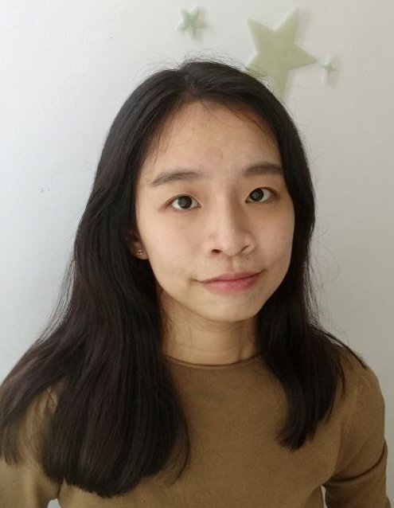
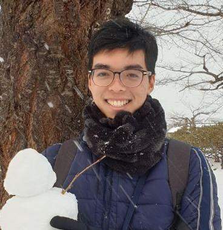

We are a team based in the [School of Computing, National University of Singapore](http://www.comp.nus.edu.sg).

You can reach us at the email `seer[at]comp.nus.edu.sg`

## Project team

### Jacob Chia Chu You

[[github](http://github.com/chuyouchia)]
[[portfolio](team/chuyouchia.md)]

* Role: Team Lead
* Responsibilities: UI

### Foong Siqi

[[github](http://github.com/foongsq)]
[[portfolio](team/foongsq.md)]

* Role: Deliverables and Deadlines
* Responsibilities: Ensure project deliverables are done on time and in the right format.

### Sruthi Saravanan

[[github](http://github.com/Sruthisarav)]
[[portfolio](team/sruthisarav.md)]

* Role: Documentation
* Responsibilities: Responsible for the quality of various project documents.

### Peng Xiang

[[github](http://https://github.com/pengxiangg)]
[[portfolio](team/pengxiangg.md)]

* Role: Integration
* Responsibilities: In charge of versioning of the code, maintaining the code repository,
integrating various parts of the software to create a whole.

### Rachel Ho Xin Ying

[[github](http://github.com/rachel170)]
[[portfolio](team/rachel170.md)]

* Role: Testing
* Responsibilities: Ensures the testing of the project is done properly and on time.
