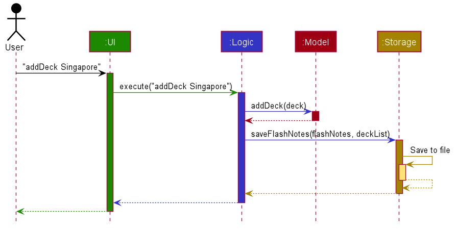

* Table of Contents
{:toc}

--------------------------------------------------------------------------------------------------------------------
## **Design**

### Architecture

The ***Architecture Diagram*** given above explains the high-level design of the App. Given below is a quick overview of each component.

**`Main`** has two classes called [`Main`](https://github.com/AY2021S1-CS2103T-T15-2/tp/blob/master/src/main/java/seedu/flashnotes/Main.java) and [`MainApp`](https://github.com/AY2021S1-CS2103T-T15-2/tp/blob/master/src/main/java/seedu/flashnotes/MainApp.java). It is responsible for,
* At app launch: Initializes the components in the correct sequence, and connects them up with each other.
* At shut down: Shuts down the components and invokes cleanup methods where necessary.

[**`Commons`**](#common-classes) represents a collection of classes used by multiple other components.

The rest of the App consists of four components.

* [**`UI`**](#ui-component): The UI of the App.
* [**`Logic`**](#logic-component): The command executor.
* [**`Model`**](#model-component): Holds the data of the App in memory.
* [**`Storage`**](#storage-component): Reads data from, and writes data to, the hard disk.

Each of the four components,

* defines its *API* in an `interface` with the same name as the Component.
* exposes its functionality using a concrete `{Component Name}Manager` class (which implements the corresponding API `interface` mentioned in the previous point.

For example, the `Logic` component (see the class diagram given below) defines its API in the `Logic.java` interface and exposes its functionality using the `LogicManager.java` class which implements the `Logic` interface.

**How the architecture components interact with each other**

The *Sequence Diagram* below shows how the components interact with each other for the scenario where the user issues the command `addDeck Singapore`.

The sections below give more details of each component.

### UI component

**API** :
[`Ui.java`](https://github.com/AY2021S1-CS2103T-T15-2/tp/blob/master/src/main/java/seedu/flashnotes/ui/Ui.java)

The UI consists of a `MainWindow` which acts as a stage, and the `MainWindow` that references a `RootNode` to display the scene.
The Root Node contains the scene, which is composed of UI parts like`CommandBox`, `ResultDisplay`, `PersonListPanel`, `StatusBarFooter` etc. All these, including the `MainWindow`, inherit from the abstract `UiPart` class.

The `UI` component uses JavaFx UI framework. The layout of these UI parts are defined in matching `.fxml` files that are in the `src/main/resources/view` folder. For example, the layout of the [`MainWindow`](https://github.com/se-edu/addressbook-level3/tree/master/src/main/java/seedu/address/ui/MainWindow.java) is specified in [`MainWindow.fxml`](https://github.com/AY2021S1-CS2103T-T15-2/tp/blob/master/src/main/resources/view/MainWindow.fxml)

The `UI` component,

* Executes user commands using the `Logic` component.
* Listens for changes to `Model` data so that the UI can be updated with the modified data.

### Model Component

**API** :
[`Model.java`](https://github.com/AY2021S1-CS2103T-T15-2/tp/blob/master/src/main/java/seedu/flashnotes/model/Model.java)

The `model`,
* Stores a `UserPref` Object that represents the user's preferences.
* Stores the Flashnotes data
* Exposes an unmodifiable `ObservableList<Flashcard>` that can be 'observed' e.g. the UI can be bound to this list so that the UI automatically updates when the data in the list changes. This list is to show cards in the card page of the Ui.
* Exposes an unmodifiable `ObservableList<Flashcard>` that can be 'observed'. This list is to show the cards that are being reviewed in the review page of the Ui.
* Exposes an unmodifiable `ObservableList<Deck>` that can be 'observed'. This list shows the list of decks in the home page of the Ui.
* Does not depend on any of the other three components.

--------------------------------------------------------------------------------------------------------------------

### Logic component

**API** :
[`Logic.java`](https://github.com/AY2021S1-CS2103T-T15-2/tp/blob/master/src/main/java/seedu/flashnotes/logic/Logic.java)

1. `Logic` uses the `FlashNotesParser` class to parse the user command.
1. This results in a `Command` object which is executed by the `LogicManager`.
1. The command execution can affect the `Model` (e.g. adding a flashcard).
1. The result of the command execution is encapsulated as a `CommandResult` object which is passed back to the `Ui`.
1. In addition, the `CommandResult` object can also instruct the `Ui` to perform certain actions, such as displaying help to the user.

Given below is the Sequence Diagram for interactions within the `Logic` component for the `execute("delete 1")` API call.

--------------------------------------------------------------------------------------------------------------------

### Storage component

**API** : [`Storage.java`](https://github.com/AY2021S1-CS2103T-T15-2/tp/tree/master/src/main/java/seedu/flashnotes/storage/Storage.java)

The `Storage` component,
* can save `UserPref` objects and general data within FlashNotes in json format.
* can read back data in json save file on next initialization of FlashNotes.
* can update save file's data during execution of a valid command entered by the user.

### Common classes

Classes used by multiple components are in the `seedu.flashnotes.commons` package.

--------------------------------------------------------------------------------------------------------------------

## **Documentation, logging, testing, configuration, dev-ops**

* [Documentation guide](Documentation.md)
* [Testing guide](Testing.md)
* [Logging guide](Logging.md)
* [Configuration guide](Configuration.md)

--------------------------------------------------------------------------------------------------------------------

## Implementation

### Create Deck feature

`FlashNotes` supports the creation of new Decks. It extends `ReadOnlyFlashNotes`, which stores internally as an `UniqueDeckList` and a `UniqueCardList`. Additionally, it implements the following operations:

* `Flashnotes#addDeck()` — Add a new Deck with a unique deck name.

`Model` interface depends on  `Flashnotes#addDeck()` to support functionality of `Model#addDeck()`.

#### Given below is an example usage scenario.

Step 1. The user launches the application for the first time. The `FlashNotes` will be initialized with the stored FlashNote state.

Step 2. The user executes `addDeck n/Deck1` command to add a new Deck in the FlashNotes. The `addDeck` command calls `Model#addDeck()`, which executes the command and saves it to `FlashNotes`.

Step 3. The user is now able to see the new `Deck1` added.

:information_source: **Note:** If the deck already exists (duplicate deck name), it will throw a `DuplicateDeckException`, so the newly created deck will not be saved into the `FlashNotes`. The implementation details are in UniqueDeckList.

#### Corresponding sequence diagram for `AddDeck`:

The following sequence diagram shows how AddDeck operation works:

:information_source: **Note:** The lifeline for `addDeckCommand` should end at the destroy marker (X) but due to a limitation of PlantUML, the lifeline reaches the end of diagram.

The following general activity diagram summarizes what happens when a user executes a new command:

#### Design consideration:

##### 2 possible designs for Adding Deck

* **Alternative 1 (current choice):** Contain a list of deck names and uses it to search up relevant flashcards.
  * Pros: Easy to implement. Suitable at this current stage because there is at most 4 cards shown at any point in time on screen. Over-optimisation is unnecessary.
  * Cons: May have performance issues if trying to find a large number cards contained by the deck.

* **Alternative 2:** Store Flashcards within deck.
  * Pros: Performance will be better than searching through all current flashcards to find the relevant cards to be initialized in the deck.
  * Cons: We must ensure that the implementation of each deck contains a direct reference to the flashcards.

### Handle invalid inputs/commands
#### Deck vs Card related commands
* The system disables card-related commands (e.g. addCard, deleteCard, editCard, review, find) when user is at the home screen.
* The system disables deck-related commands (e.g. addDeck, deleteDeck, enterDeck, list, clear) when user is inside a deck.
* Flashnotes keeps track of whether the user is currently inside a deck, and the name of the deck that the user is currently in.
* The Parser will block these commands, taking arguments passed from Logic, which checks the state of Flashnotes through the model.

#### Review related commands
* The system only allows review-related commands (e.g. flip, correct, wrong, endReview)
* Flashnotes also keeps track of whether the user is currently inside review mode.
* The Parser (logic) will check if the user is in review mode through the model, and disables certain commands if the user is currently in a review session.

#### Design considerations:
* Alternative 1 (current choice): Checking of commands are done in the logic component.
    * Pros: Model component does not need to keep track and handle invalid inputs by user
    * Cons: Coupling between logic and model is increased
* Alternative 2: Checking of commands are done in the model component.
    * Pros; Reduced coupling
    * Cons: Model has to handle commands, reducing cohesion.

### Review Mode 
Our FlashNotes application allows users to test their knowledge and mastery of flashcards through a review session.

#### Implementation
The review session is implemented by opening a new JavaFX window. This new window has its own command box (where users type in commands)
and result display box (where the application displays messages to the user). On top of that, there is also the Individual Flashcard section
of the window that shows the question of 1 flashcard. When the "flip" command is executed, 
the answer to that question will be showed instead.

To support the opening of this review session, the following commands were added:
* `review` - A command that sets up the list of flashcards to review and opens a new review window displaying those cards.

The following is a sequence diagram that demonstrates how a review command sets up the review session:

`ModelManager#shuffleReviewFlashcards` method sets up the list of flashcards to review inside `Model`.
It duplicates the list of filtered flashcards in the model as of the moment that the review command was
called, it then shuffles these cards using the `FXCollections.shuffle()` method, and it trims the list of
flashcards to review according to the review limit set by users.

#### Design considerations:
* Alternative 1 (current choice): Open a new JavaFX window
    * Pros: Differentiates the review mode from the other modes better visually, 
    allows the UI for the review mode to be minimalistic, reducing distractions for users when reviewing their flashcards.
    * Cons: We would have to create a new window with another command box and result display, and display
    the main command box.
* Alternative 2: Implement the review session in the same window as the rest of the application.
    * Pros: Can use the same command box and result display so that we would not have to create new command boxes and result
    display boxes and disable main command box. 
    * Cons: The UI looks more cluttered and users might get distracted when reviewing their flashcards

### Set Review Limit feature
Our FlashNotes application allows users to set the maximum number of cards that they want to review in a single
review session (review limit). 

#### Implementation
Users only have to set the review limit once and it will be saved as user preferences in a storage file. Users will
then only need to use this feature again when they want to change the review limit again in the future.

The initial value for the review limit is set to 0 in `preferences.json`, which tells the program that the user did not
set a review limit and hence the program will allow users to review all their flashcards in a certain deck at each review
session. 

The valid range of integer inputs for this command is any integer more than 1 however, as we thought it wouldn't 
make sense on the user's end to set 0 or negative values as the review limit.

The following is an activity diagram showing how the set review command is intended to be used
when a user wants to use FlashNotes to review a deck of flashcards.

#### Design considerations:
* Alternative 1 (current choice): Save review limit in the user preferences file.
    * Pros: Users would not have to set review limit every time they start up the application.
    * Cons: We have to write to the data file `preferences.json` instead of simply saving the limit as a variable in model.
* Alternative 2: Save review limit internally in Model
    * Pros: Do not have to write into a data file.
    * Cons: Users would have to set review limit every time they start up the application.

### Flip Card feature
Our FlashNotes application allows users to flip the cards they are currently reviewing in the review mode to
see the answer for the question on the flashcard.    

#### Implementation
Users only have to type the `flip` command to flip their flashcard. Users can flip the flashcard as many times as they
would like to in the review mode.

The initial value of `isFlipped` is set to false, so that the review mode is showing the question on the flashcard first.

To support the flipping of flashcards, the following commands were added:
* `flip` - A command that flips the flashcard being reviewed and displays the question or answer depending on the number
 of times the card was flipped.

The following is a sequence diagram that demonstrates how a flip command flips a card in the review session:

This feature is implemented by adding an isFlipped boolean in the `Model` of the `Flashcard`. To toggle this boolean,
a function call is made from the `ModelManager#carryOutFlipCommand()` which is called by the `FlipCommand#execute()` 
when it is created from the `FlashNotesParser`.

#### Design considerations:
* Alternative 1 (current choice): Change isFlipped boolean in the flashcard model
    * Pros: Only need the instance of the flashcard to update or check whether the particular flashcard has been flipped in
    the review mode.
    * Pros: Ensures that the logic of flipping of flashcard isn't done in the UI
    * Cons: Increases coupling
* Alternative 2: Implement the boolean isFlipped in the UI part, IndividualFlashcard.
    * Pros: No need for extra function calls as flipping is directly done in the UI
    * Cons: Logic is being done in the UI section
    * Cons: Hard to test using testcases. Have to manually test.
    
### Next Card feature
Our FlashNotes application allows users to go to the next card to review once they are done reviewing the current 
flashcard.    

#### Implementation
Users only have to type the `c` or `w` command to see the next flashcard where `c` means that they managed to review
the flashcard correctly and `w` means that they got the question wrong. These commands will only work after the user
sees the answer of the flashcard currently being reviewed which is noted by whether the flashcard has been flipped or
not. 

The initial value of `isCorrect` is set to 0 to denote that the card has yet to be reviewed.

To support the ability to go to the next flashcard in the review session, the following commands were added:
* `c` - A command that goes to the next flashcard after marking the flashcard as correct.
* `w` - A command that goes to the next flashcard after marking the flashcard as wrong and adding it back to the review
        list.

The following activity diagram summarizes what happens when a user executes a `c` or `w` command:

This feature is implemented by adding an isCorrect int in the `Model` of the `Flashcard`. To update this int,
a function call is made from the `ModelManager#markFlashcardBeingReviewed(int result)` which is a call from 
`CorrectCommand#execute()` or `WrongCommand#execute()` when it is created by the `FlashNotesParser`.

#### Design considerations:
* Alternative 1 (current choice): Change isCorrect int in the flashcard model
    * Pros: Only need the instance of the flashcard to update or check whether the particular flashcard has been reviewed 
    correctly by the user in the review mode.
    * Pros: Ensures that the logic of marking the result of user's review of flashcard isn't done in the UI
    * Cons: Increases coupling
* Alternative 2: Implement the int isCorrect in the UI part, IndividualFlashcard.
    * Pros: No need for extra function calls as marking the result of the review can be directly done in the UI
    * Cons: Logic is being done in the UI section
    * Cons: Hard to test using testcases. Have to manually test.

### Review Statistics feature

#### Implementation

FlashNotes application supports testing of the user's knowledge of the flashcards through a review session. To provide more value to the review session, FlashNotes should be able to track the number of cards answered correctly by the user on their first attempt at the question during the review session. This statistical value will be displayed to the user at the end of the review session and saved only when the user ends the review session properly.

To support this feature, a new command have been added to FlashNotes:
* `endReview` - A command that closes the review session's window at the end of the review session, and handles the ending process of review session. (Only available in review mode.)

To support the storage of each deck's review statistic, a new class has been added to the Storage component in FlashNotes:
* `JsonAdaptedDeck` object contain two variable for Deck Storage, `String deckName` to identify the deck, and `String resultStatistics` to contain the deck's review statistics.
* `JsonAdaptedDeck#updateModel(FlashNotes flashNotes)` is a method used to update the generated model from reading the flashcard data with the deck's data. It depends on `FlashNotes#updateDeckPerformanceScore(Integer reviewScore, String deckName)` to update the generated model with the deck data from the save file.

`JsonSerializableFlashNotes` object has been adjusted to depend on a list of `JsonAdaptedDeck` objects to read and write each deck's data to the FlashNotes save file.

Additionally, the following operations have been implemented to support this feature:
* Model component:
    * `FlashNotes#updateDeckPerformanceScore(Integer reviewScore, String deckName)` - Updates the reviewStatistics attribute of a specific deck (through deckName) with the given Integer value (reviewScore).
    * `FlashNotes#getUniqueDeckList()` - Return the FlashNotes' model's `UnqiueDeckList`.
    * `UniqueDeckList#findDeck(String deck)` - Returns an existing `Deck` object from its `internalList` with the same `deckName` as the given String input. If no such `Deck` object exist, a `null` object is returned instead.
* UI component:
    * `IndividualFlashcard#displayStatistics()` - Calculates the user's review session's score, updates the model with the generated statistics and set display of the end of the review session.

`Model` interface depends on  `Flashnotes#updateDeckPerformanceScore(Integer reviewScore, String deckName)` to support functionality of `Model#updateDeckPerformanceScore(Integer reviewScore, String deckName)` that `FlashNotes` implements. Similarly, `Logic` interface depends on  `Model#updateDeckPerformanceScore(Integer reviewScore, String deckName)` to support functionality of `LogicManager#updateDeckPerformanceScore(Integer reviewScore)` that implements it.

Further more, the following operations have been adjusted to support the feature:
* `Storage#saveFlashNotes(ReaOnlyFlashNotes flashNotes)` - This operation, and all methods dependent on it, has been expanded to accept an additional parameter `UniqueDeckList decklist` to facilitate the saving of the deck data in FlashNotes.
* `FlashNotes#resetData(ReadOnlyFlashNotes newData)` - This operation has been adjusted to include the recreation of the FlashNotes model's deck data read from Storage.

To provide the UI display and changes related to review statistics, the following UI component have received several code additions:
* `DeckCard` - Changed constructor method to for display of review statistics at the end of a review session.
* `ReviewWindow#handleExit()` - Adjusted to return to card view upon execution of `endReview` command.

##### Given below is a basic description of the backend process of the feature:

1. User reaches the end of the review session (by correctly answering the last of the questions that has not been answered yet or has been answered wrongly before). 

2. The UI component will calculate the user's score by generating the percentage of cards the user answered correctly on the first try during the session.

3. The generated review session statistic is passed to the Model component through the Logic component, where the `FlashNotes` model updates the relevant deck with the generated value.

4. FlashNotes' UI component will display the review statistics generated as part of the end of review session message.

5. User enters `endReview` command to end the review session.

6. The processing of the `endReview` command through the Parser component will lead to the command execution in Logic component and trigger the save function of FlashNotes, thus updating FlashNote's json file with the new review session statistic for the deck.

##### Corresponding sequence diagram for `endReview`:

The following sequence diagram shows how the endReview command operation works:

#### Design consideration:

* **Current choice:** Expand save feature to include decks' data instead of only saving flashcards' data.
  * Pros: Partial implementation available to build on. Implementation can provide base code for future addition to Deck data that needs to be saved as well.
  * Cons: Design and implementation for Deck and UniqueDeckList is not a concrete feature yet, changes done now may clash with future expansion of the feature.

* **Alternative 2:** Store review statistics as an attribute of Tag
  * Pros: Easier to implement, simply expand tag feature to include review statistics data of the deck that the tag is representing.
  * Cons: Will result in storing several repetitions of the statistics since it is an add-on to each instance of a unique tag in the json file. This can needlessly take up more space if there are a huge amount of flashcards and only a few decks.

--------------------------------------------------------------------------------------------------------------------

## **Appendix: Requirements**

### Product scope

**Target user profile**:

* NUS FASS student who likes to write down lecture notes
* practices active learning techniques via flash cards
* prefer desktop apps over other types
* can type fast
* prefers typing to mouse interactions
* is reasonably comfortable using CLI apps

**Value proposition**: manage, read and create flashcards faster than a typical mouse/GUI driven app

### User stories

Priorities: High (must have) - `* * *`, Medium (nice to have) - `* *`, Low (unlikely to have) - `*`

| Priority | As a …​                                    | I want to …​                     | So that I can…​                                                        |
| -------- | ------------------------------------------ | ------------------------------ | ---------------------------------------------------------------------- |
| `* * *`  | new user                                   | see usage instructions         | refer to instructions when I forget how to use the App                 |
| `* * *`  | user                                       | add a new deck                 |                                                                        |
| `* * *`  | user                                       | open a deck                    | see what flashcards I have created in that deck so far                 |
| `* * *`  | user                                       | delete a deck                  | get rid of decks of flashcards that I no longer need quickly           |
| `* * `   | user                                       | rename a deck                  | organize my decks better                                               |
| `* * *`  | user                                       | add a new card                 |                                                                        |
| `* * *`  | user                                       | delete a card                  | remove entries that I no longer need                                   |
| `* * *`  | user                                       | find a card by keyword         | locate certain cards without having to go through the entire list      |
| `* * *`  | user                                       | review a deck                  | test my knowledge about the content of the cards in that deck          |
| `* * *`  | user                                       | mark a flashcard as right or wrong | keep track of which cards I have already mastered and which cards I still need to review again |
| `* * *`  | user                                       | see how many cards I got correct after a review session | track my topics mastery and feel a sense of accomplishment for studying efficiently |
| `* *`    | user                                       | hide old cards                 | clear clutter when there are too many cards in the deck                |
| `*`      | user with many related cards in the app    | nest the card decks by tags    | locate a cards of the same group easily when reviewing                 |

### Use cases

####**Use case: UC01 - Review cards**

####Precondition: Cards that will be reviewed are already selected; User sees the full list of cards in the given deck.

**MSS:**

1. Deck selects the relevant number of cards from current storage and displays it.
1. User start reviewing using the cards that are currently being displayed in deck.
1. Start review in a different window.
1. Card appears.
1. Card flipped.
1. Card marked as correct or wrong.
1. Repeat steps 4 to 6 until Deck ends.
1. Show Review statistics.
1. Close Window.
1. Return to list view of deck in the main window.

    Use case ends.

**Extension:**

* 6a. User marks the card as correct.
   * 6a.1. System shows next card.  
   Use case resumes from Step 4.

* 6b. User marks card as wrong.
   * 6b.1. System adds card back into the queue.
   * 6b.2. System shows the next card.  
   Use case resumes from Step 4.

* *User ends the review session prematurely.
    * *a. Review statistics screen not shown.
    * *b. Review statistics not updated in the deck list.  
    Use case resumes from Step 10.

####**Use case: UC02 - Create new Deck**
#####Precondition: User is in the Home Screen, and is not in review mode.

**MSS:**

1. User enters command to create a new deck.
1. User enters empty deck view.
1. User returns to main screen.

    Use Case Ends.

**Extension:**

* 1a. Deck name is a duplicate of existing decks.
    * 1a.1. Raise error and stay in Home Screen.  
    Use case ends.
    
* 2a. User creates new card in deck view (UC04).
    * 2a.1.  Card tagged with the deck name.  
    Use case resumes from Step 3.

* 2b. User deletes card (UC03).  
    Use case resumes from Step 3.

* 2c. User edits card (UC05).  
    Use case resumes from Step 3.

####**Use case: UC03 - Delete a Card**
#####Precondition: User is in the Home Mode, and is not in review mode.

**MSS**

1. User requests to list cards.
1. Flashnotes shows a list of cards.
1. User requests to delete a specific card in the list.
1. Flashnotes deletes the card.

    Use case ends.

**Extensions**

* 2a. The list is empty.
    Use case ends.
    
* 3a. The given index is invalid.
    * 3a.1. Flashnotes shows an error message.  
    Use case resumes at Step 2.

####**Use case: UC04 - Add a card**
#####Precondition: Must be inside the deck view.

**MSS**

1. User add card.
1. Flashnotes adds the card.

    Use case ends.

**Extensions**

* 2a. There is a duplicate card.
    * 2a.1. Flashnotes shows an error message.  
    Use case resumes at Step 2.

####**Use case: UC05 - Edit a card**
#####Precondition: Must be inside the card mode.

**MSS**

1. User requests to list cards.
1. Flashnotes shows a list of cards.
1. User requests to edit a specific card in the list.
1. Flashnotes edits the card.

    Use case ends.

**Extensions**

* 2a. The list is empty.  
    Use case ends.
* 3a. The given index is invalid.
    * 3a.1. Flashnotes shows an error message. 
    Use case resumes at step 2.

#####**Use case: UC06 - Open Existing Deck**
#####Precondition: User is in the Home Mode, and is not in review mode.

**MSS**

1. User filters all cards belonging to a particular deck.
1. Flashnotes shows a list of cards using the card mode.

    Use case ends.

**Extensions**

* 1a. User enters a tag that is not found.
    * 1a.1. Flashnotes returns empty card list.  
    Use case ends.

####**Use case: UC07 - Delete current Deck**
#####Precondition: User is in the Home Mode, and is not in review mode. If in deck view mode, cannot delete.

**MSS:**

1. User enters command to delete an existing deck.
1. Deck delete success message shown in main screen.

    Use Case ends.

**Extension:**

* 2a. Tries to delete deck.
    * 2a.1 Deck not found.
    * 2a.2 Display Error Message.  
    Use Case ends.

####**Use case: UC07 - Rename current Deck**
#####Precondition: User is in the Home mode, and is not in review mode.

**MSS:**

1. User enters command to rename an existing deck.
1. Deck renamed with success message shown.
1. User returns to the main screen.

    Use Case ends.

**Extension:**

* 2a. User renames deck to the same name as an already existing deck.
    * 2a.1 Error message is shown in the main screen and the deck will not be renamed.   
    Use Case ends.

####**Use case: UC08 - Return to Home mode**
#####Precondition: User is not in Home mode and not in review mode.

**MSS:**

1. User enters Home Command.
1. User returns to main screen.

    Use Case ends.

**Extension:**

* 2a. Already in the Home screen.
    * 2a.1. Return message to remind user.  
    Use Case ends.

### Non-Functional Requirements

1.  Should work on any _mainstream OS_ as long as it has Java `11` or above installed.
2.  Should be able to hold up to 1000 cards without a noticeable sluggishness in performance for typical usage.
3.  A user with above average typing speed for regular English text (i.e. not code, not system admin commands) should be able to accomplish most of the tasks faster using commands than using the mouse.
4.  Interactions should not take more than 2 seconds.
5.  The user can directly edit the data file to add or edit flashcards.
6.  The user can import or export the flashcards by adding/copying a new json file with the same name.
7.  Should be usable by someone not used to CLI.

### Glossary

* **Mainstream OS**: Windows, Linux, Unix, OS-X
* **Flashnotes**: The software that stores flashcards.
* **Flashcard**: A card with a question and answer, and may contain a tag.
* **Deck**: A collection of flashcards.
* **Home screen**: The home screen displays a list of decks of flashcards.
* **Card screen**: The card screen displays a list of flashcards in a specific deck.
* **Review mode**: The mode in which users can navigate through flashcards to review, and test their knowledge on the content of those cards.
* **Tag**: A note to group cards of a certain category together.
* **Review card limit**: The maximum number of cards that can be reviewed in a single review session.
* **Review Mode**: a mode which displays cards from a deck individually in shuffled order.
* **Card Mode**: A mode which displays a list of cards
* **Home Mode**: A mode which displays a list of decks

--------------------------------------------------------------------------------------------------------------------

## **Appendix: Instructions for manual testing**

Given below are instructions to test the app manually.

:information_source: **Note:** These instructions only provide a starting point for testers to work on;
testers are expected to do more *exploratory* testing.

### Launch and shutdown

Initial launch

   1. Download the jar file and copy into an empty folder

   2. Double-click the jar file Expected: Shows the GUI with a set of sample flashcards. The window size may not be optimum.

Saving window preferences

   1. Resize the window to an optimum size. Move the window to a different location. Close the window.

   2. Re-launch the app by double-clicking the jar file. 
       Expected: The most recent window size and location is retained.

### Deleting a card

Deleting a card while all persons are being shown

   1. Prerequisites: List all cards using the `list` command. Multiple cards in the list.

   2. Test case: `delete 1` 
      Expected: First card is deleted from the list. Details of the deleted card shown in the status message. Timestamp in the status bar is updated.

   3. Test case: `delete 0` 
      Expected: No card is deleted. Error details shown in the status message. Status bar remains the same.

   4. Other incorrect delete commands to try: `delete`, `delete x`, `...` (where x is larger than the list size) 
      Expected: Similar to previous.

### Entering a deck
Entering a deck

   1. Prerequisites: Flashnotes have decks with names 'Singapore' and 'Malaysia'
    
   2. Test case: `enterDeck Singapore`  
       Expected: All cards with the tag 'Singapore' will be shown. Cards with tags 'Malaysia' will not be shown.    
    
   3. Test case: `enterDeck singapore`  
       Expected: None of the cards are shown (as the keyword is case-sensitive)       

   4. Test case: `enterDeck Singapore Malaysia`  
       Expected: No cards are shown as there is no deck with a name 'Singapore Malaysia'.

### Reviewing a deck of cards
1. Opening the review window

    1. Prerequisites: User is in card screen
    
    1. Test case: `review`  
       Expected: A new window should pop up containing a command box, result display, and the question on the first flashcard.
    
    1. Test case: `review 7`  
       Expected: A new window should pop up containing a command box, result display, and the question on the first flashcard.
        
    1. Test case: `review hello`  
       Expected: A new window should pop up containing a command box, result display, and the question on the first flashcard.
            
1. Flipping a card

1. _{ more test cases …​ }

### Setting the review card limit
1. Setting the maximum number of cards that can be reviewed in a single review session.

    1. Prerequisites: User is in Home screen or Card screen.
    
    1. Test case: `set-review-limit 20`  
       Expected: The message "Review card limit successfully updated!" should appear in the result display box.
       
    1. Test case: `set-review-limit 0`  
       Expected: The message "Review card limit must be an integer greater than 0." should appear in the result display box.
        
    1. Test case: `set-review-limit all`  
       Expected: The message "Review card limit successfully updated!" should appear in the result display box.
       
    1. Test case: `set-review-limit 20` from the review window  
       Expected: The message "This command is not available in review mode. Please exit the review mode by typing 'endReview' and try again." should appear in the result display box.

### Flipping flashcard that is being reviewed
1. Type `flip` in the command box
    1. Prerequisites: User is in review mode, and the review session is still ongoing
    1. Test case: `flip` when the card is showing the question 
        Expected: The card should be flipped to show the answer for this question  
    1. Test case: `flip` when the card is showing the answer  
        Expected: The card should be flipped to show the question for this answer  
    

### Marking flashcard that is being reviewed as correct
1. Type `c` in the command box
    1. Prerequisites: User is in review mode, and the review session is still ongoing
    1. Test case: `c` when the card is showing the question 
        Expected: Error Message to indicate that the card should be flipped first before it can be marked as correct  
    1. Test case: `c` when the card is showing the answer  
        Expected: If the card wasn't the last card in the list, it should show the question of the next card and the progress in the progress bar should increase. Otherwise, it should show the review statistics.

### Marking flashcard that is being reviewed as wrong
1. Type `w` in the command box
    1. Prerequisites: User is in review mode, and the review session is still ongoing
    1. Test case: `w` when the card is showing the question 
        Expected: Error Message to indicate that the card should be flipped first before it can be marked as wrong  
    1. Test case: `w` when the card is showing the answer  
        Expected: It should show the question of the next card and the progress bar should still have the same progress.
