* Table of Contents
{:toc}

--------------------------------------------------------------------------------------------------------------------
## **Introduction**
This documentation contains an overview of the structure and implementation of FlashNotes. It is made for 
developers who wish to maintain, modify or understand the software development behind FlashNotes.

There are a total of 4 sections in this Developer Guide: 

* Design: Discusses the high-level design of FlashNotes.

* Links: Consists of links to guides used in Documentation, logging, testing, configuration and dev-ops.

* Implementation: Covers the additional key features and considerations behind each design decision made in 
    FlashNotes.

* Appendix: Consists of 3 sections which are: Requirement, Manual Testing and Effort. 
    * Requirement: Covers the product scope, user stories, use cases, non-functional requirements and glossary.
    * Manual Testing: Covers how to test each additional feature we added to FlashNotes.
    * Effort: Covers challenges faced.

## **Design**

### Architecture

The ***Architecture Diagram*** given above explains the high-level design of the App. Given below is a quick overview of each component.

**`Main`** has two classes called [`Main`](https://github.com/AY2021S1-CS2103T-T15-2/tp/blob/master/src/main/java/seedu/flashnotes/Main.java) and [`MainApp`](https://github.com/AY2021S1-CS2103T-T15-2/tp/blob/master/src/main/java/seedu/flashnotes/MainApp.java). It is responsible for,
* At app launch: Initializes the components in the correct sequence, and connects them up with each other.
* At shut down: Shuts down the components and invokes cleanup methods where necessary.

[**`Commons`**](#common-classes) represents a collection of classes used by multiple other components.

The rest of the App consists of four components.

* [**`UI`**](#ui-component): The UI of the App.
* [**`Logic`**](#logic-component): The command executor.
* [**`Model`**](#model-component): Holds the data of the App in memory.
* [**`Storage`**](#storage-component): Reads data from, and writes data to, the hard disk.

Each of the four components,

* defines its *API* in an `interface` with the same name as the Component.
* exposes its functionality using a concrete `{Component Name}Manager` class (which implements the corresponding API `interface` mentioned in the previous point.

For example, the `Logic` component (see the class diagram given below) defines its API in the `Logic.java` interface and exposes its functionality using the `LogicManager.java` class which implements the `Logic` interface.

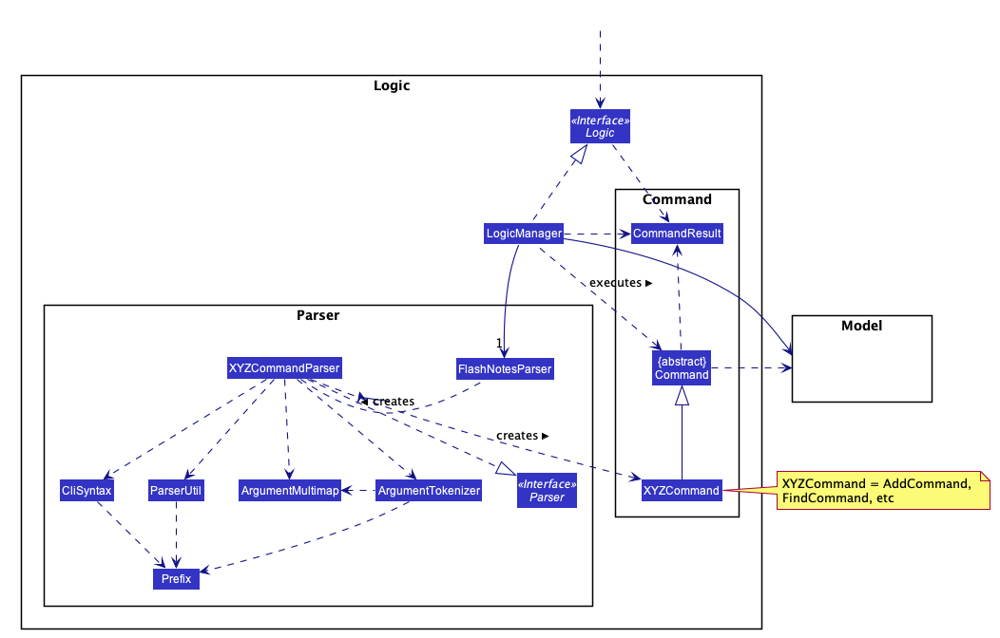

**How the architecture components interact with each other**

The *Sequence Diagram* below shows how the components interact with each other for the scenario where the user issues the command `addDeck n/Singapore`.

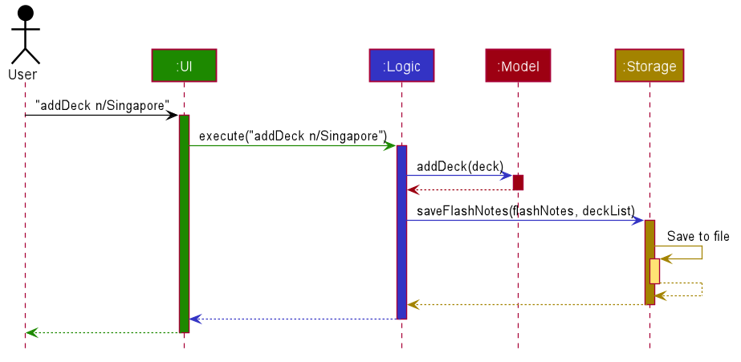

The sections below give more details of each component.

### UI component

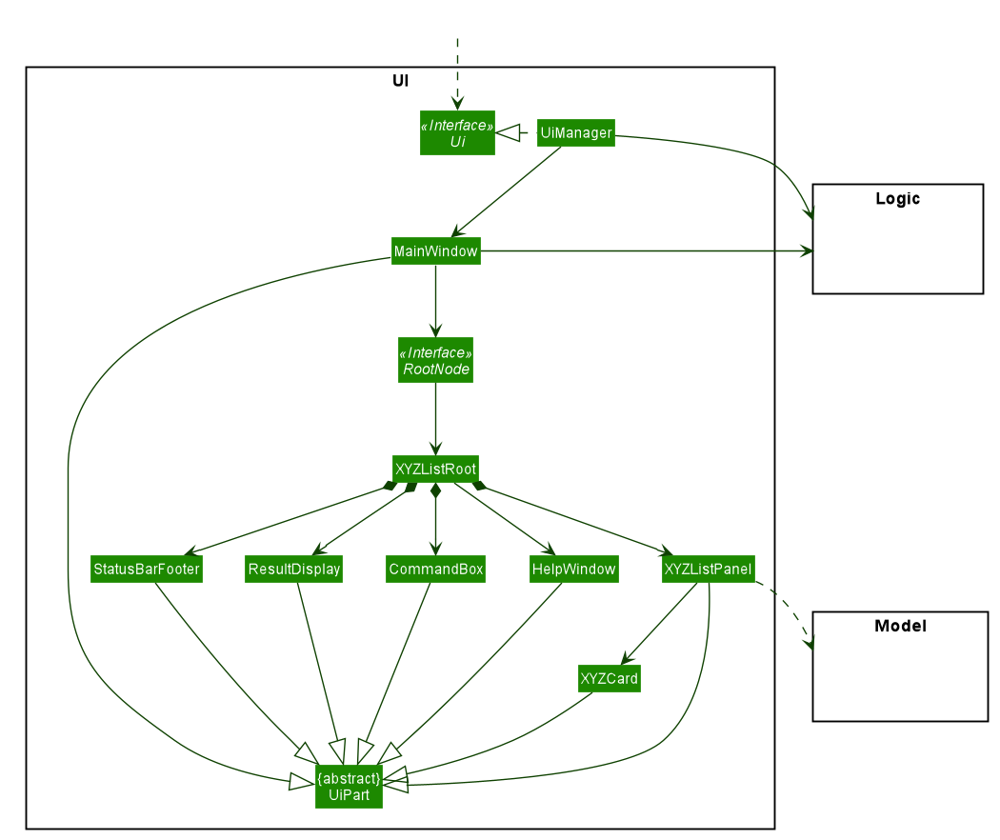

**API** :
[`Ui.java`](https://github.com/AY2021S1-CS2103T-T15-2/tp/blob/master/src/main/java/seedu/flashnotes/ui/Ui.java)

The UI consists of a `MainWindow` which acts as a stage, and the `MainWindow` that references a `RootNode` to display the scene.
The Root Node contains the scene, which is composed of UI parts like`CommandBox`, `ResultDisplay`, `PersonListPanel`, `StatusBarFooter` etc. All these, including the `MainWindow`, inherit from the abstract `UiPart` class.

There are 2 different types of implementations available for the root node. One of them is the FlashCardListRoot, and the other is the DeckCardListRoot. Both classes implement RootNode interface so that the MainWindow object can access both through polymorphism.

Note that the Review Window is a component of the FlashCardListRoot and not a component of the DeckCardListRoot. As a result, the review window can only be initiated from the FlashCardListRoot.

The 2 of the 3 different modes mentioned in the user guide corresponds to the 2 implementations of root node. The last one corresponds to the Review window in terms of UI display. More info can be found at [Implementation of UI.](#implementation-of-ui-3-different-modes)

The `UI` component uses JavaFx UI framework. The layout of these UI parts are defined in matching `.fxml` files that are in the `src/main/resources/view` folder. For example, the layout of the [`MainWindow`](https://github.com/AY2021S1-CS2103T-T15-2/tp/blob/master/src/main/java/seedu/flashnotes/ui/MainWindow.java) is specified in [`MainWindow.fxml`](https://github.com/AY2021S1-CS2103T-T15-2/tp/blob/master/src/main/resources/view/MainWindow.fxml)

The `UI` component,

* Executes user commands using the `Logic` component.
* Listens for changes to `Model` data so that the UI can be updated with the modified data.

### Model Component
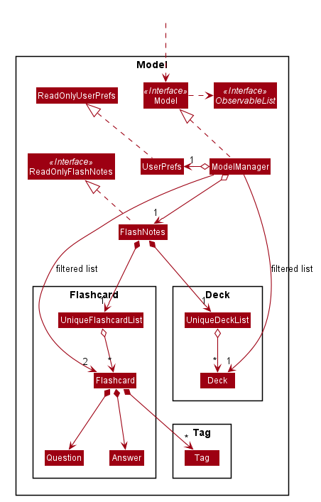

**API** :
[`Model.java`](https://github.com/AY2021S1-CS2103T-T15-2/tp/blob/master/src/main/java/seedu/flashnotes/model/Model.java)

The `model`,
* Stores a `UserPref` Object that represents the user's preferences.
* Stores the Flashnotes data
* Exposes an unmodifiable `ObservableList<Flashcard>` that can be 'observed' e.g. the UI can be bound to this list so that the UI automatically updates when the data in the list changes. This list is to show cards in the card page of the Ui.
* Exposes an unmodifiable `ObservableList<Flashcard>` that can be 'observed'. This list is to show the cards that are being reviewed in the review page of the Ui.
* Exposes an unmodifiable `ObservableList<Deck>` that can be 'observed'. This list shows the list of decks in the Main Mode of the Ui.
* Does not depend on any of the other three components.
* The `Tag` of each Flashcard refers to which `Deck` the `Flashcard` belongs to.
* FlashNotes will handle the association between `Tag` and `Deck`.

--------------------------------------------------------------------------------------------------------------------

### Logic component

**API** :
[`Logic.java`](https://github.com/AY2021S1-CS2103T-T15-2/tp/blob/master/src/main/java/seedu/flashnotes/logic/Logic.java)

1. `Logic` uses the `FlashNotesParser` class to parse the user command.
1. This results in a `Command` object which is executed by the `LogicManager`.
1. The command execution can affect the `Model` (e.g. adding a flashcard).
1. The result of the command execution is encapsulated as a `CommandResult` object which is passed back to the `Ui`.
1. In addition, the `CommandResult` object can also instruct the `Ui` to perform certain actions, such as displaying help to the user.

Given below is the Sequence Diagram for interactions within the `Logic` component for the `execute("deleteDeck 1")` API call.

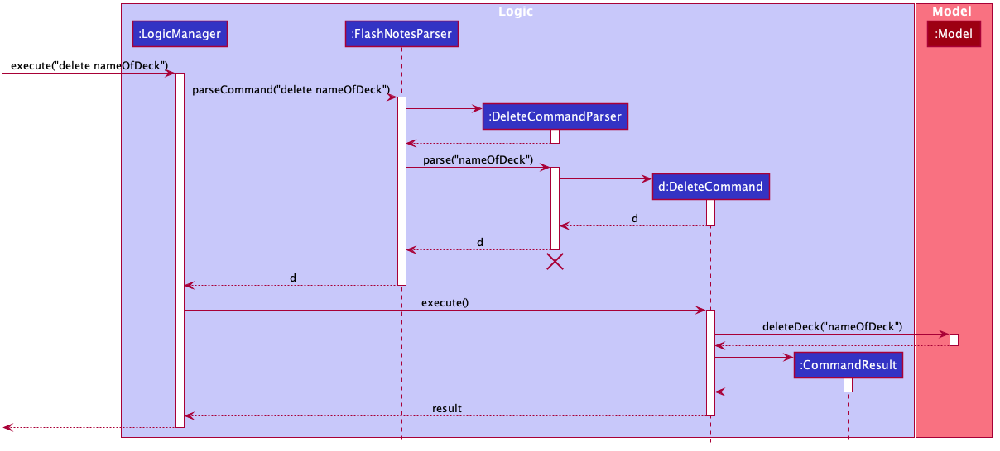

--------------------------------------------------------------------------------------------------------------------

### Storage component

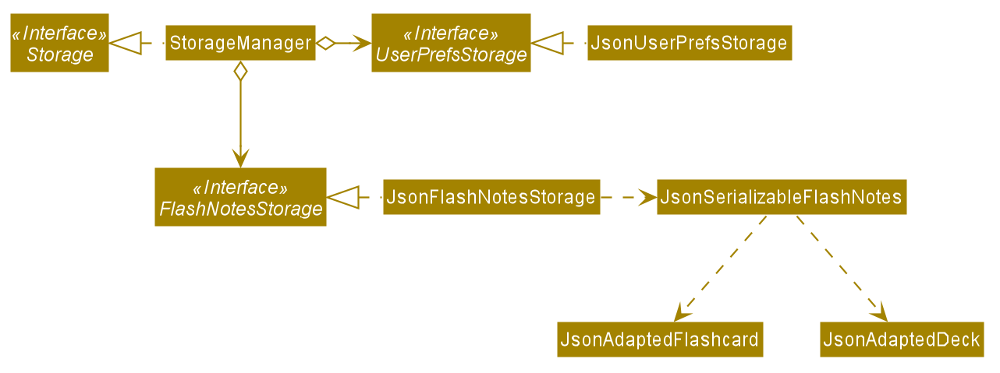

**API** : 
[`Storage.java`](https://github.com/AY2021S1-CS2103T-T15-2/tp/tree/master/src/main/java/seedu/flashnotes/storage/Storage.java)

The `Storage` component,
* can save `UserPref` objects and general data within FlashNotes in json format.
* can read back data in json save file on next initialization of FlashNotes.
* can update save file's data during execution of a valid command entered by the user.

### Common classes

Classes used by multiple components are in the `seedu.flashnotes.commons` package.

--------------------------------------------------------------------------------------------------------------------

## **Documentation, logging, testing, configuration, dev-ops**

* [Documentation guide](Documentation.md)
* [Testing guide](Testing.md)
* [Logging guide](Logging.md)
* [Configuration guide](Configuration.md)

--------------------------------------------------------------------------------------------------------------------

## **Implementation**
### Implementation of UI (3 Different Modes)

Both of the root nodes represent the types of scenes available to the main window:
* `FlashCardListRoot` contains `FlashCardListPanel` which will display a list of flashcards available to the user.
* `DeckCardListRoot` contains `DeckCardListPanel` which will display a list of decks available to the user.

The reasoning for splitting out the two different types of scenes is to allow the Main Window to solely perform the function of the stage, while having the root nodes handle the logic related to the individual scenes and their components.
This provides better cohesion and utilizes the single responsibility principle as the classes are individually responsible for a smaller part of the UI rendered. It also improves the extensibility for the future if more modes and screens are to be added to the product.

Similarly, we also chose to separate the review mode from the Main and Card mode. However, we decided to open a new 
JavaFX window for users to review their cards in instead. This is because opening a new window allows us to 
differentiates the review mode from the other modes better visually. This way, the UI for the review mode can also be 
more minimalistic, reducing distractions for users when reviewing their flashcards.

We also fixed the review window to be a small size. Since there is a 140 character limit for questions and answers, we 
thought that there would be no need for users to maximize the review window, so we disabled that ability.

When the review window is open, there would be a total of 2 command boxes on the user's screen, (one in the main 
window and one in the review window). We did not think that it would make sense for the user to be interacting with the 
main window when they are in review mode, so we decided to disable the command box in the main window when the review 
window is open. This is so that users can focus more on the review session.
    
### Implementation of commands

The following general activity diagram summarizes what happens when a user executes a new command:

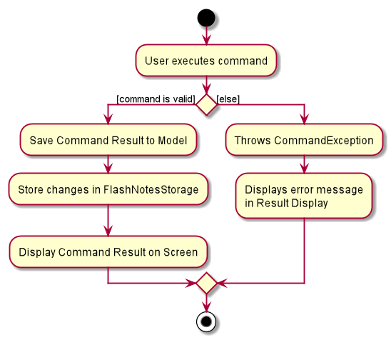

### Handle invalid inputs/commands

#### Deck vs Card related commands
* The system disables card-related commands (e.g. addCard, deleteCard, editCard, review, find) when user is at the Main mode.
* The system disables deck-related commands (e.g. addDeck, deleteDeck, enterDeck, clear) when user is inside a deck.
* FlashNotes keeps track of whether the user is currently inside a deck, and the name of the deck that the user is currently in.
* The Parser will block these commands, taking arguments passed from Logic, which checks the state of FlashNotes through the model.

#### Review related commands
* The system only allows review-related commands (e.g. f, c, w, endReview)
* FlashNotes also keeps track of whether the user is currently inside review mode.
* The Parser (logic) will check if the user is in review mode through the model, and disables certain commands if the user is currently in a review session.

#### Design considerations: How to check for invalid commands
* **Alternative 1 (current choice):** Checking of commands are done in the logic component.
    * Pros: Model component does not need to keep track and handle invalid inputs by user
    * Cons: Coupling between logic and model is increased
* **Alternative 2:** Checking of commands are done in the model component.
    * Pros: Reduced coupling
    * Cons: Model has to handle commands, reducing cohesion.

### Implementation of Main Mode features

#### 3 possible designs for Decks in Main Mode

In the planning phrase, our team came up with 3 possible alternatives for how we wanted to implement decks in our flashcard app, and the details were as follows:

* **Alternative 1 (current choice):** List of Decks and list of flashcards stored independently
  * Pros:
    * Initialization of flashcard list and deck list is very fast using the stored data.
    * No need to store duplicate cards if one card belongs to more than 1 deck, thus saving space
  * Cons: 
    * When retrieving cards belonging to a certain deck, it may take a long while to filter the relevant cards if the total list of cards become huge

* **Alternative 2:** Store Flashcards within the deck.
  * Pros: 
    * Speed of retrieving cards belonging to a deck would be faster than in alternative 1
  * Cons:
    * Requires an overhaul of the code base and all references of flashcards.
    * If a card needs to belong to more than 1 deck, then duplicate cards need to be created for that purpose. This results in unnecessary space wasted.

* **Alternative 3:** Use tag object in individual flashcards to directly represent deck objects
  * Pros: 
    * Easy to implement by transforming AB3.
  * Cons: 
    * Slow to render if there are too many cards to be searched through.
    * May need to create a default card that stores the relevant tags for decks that are empty, which is unintuitive and unnecessary.
    
Alternative 1 and 2 were the strongest candidates, but alternative 1 won out due to ease of implementation and extensibility. 
With alternative 1, it saves more space, and the performance difference is negligible when trying to filter the flashcard list since the UI only needs to render 4 cards at any point in time.

#### Adding a new Deck feature

`FlashNotes` supports the creation of new Decks. It extends `ReadOnlyFlashNotes`, which stores internally as an `UniqueDeckList` and a `UniqueCardList`. Additionally, it implements the following operations:

* `FlashNotes#addDeck()`  —  Add a new Deck with a unique deck name.

`Model` interface depends on  `FlashNotes#addDeck()` to support functionality of `Model#addDeck()`.

##### Given below is an example usage scenario.

Step 1. The user launches the application for the first time. The `FlashNotes` will be initialized with the stored FlashNote state.

Step 2. The user executes `addDeck n/Deck1` command to add a new Deck in the FlashNotes. The `addDeck` command calls `Model#addDeck()`, which executes the command and saves it to `FlashNotes`.

Step 3. The user is now able to see the new `Deck1` added.

:information_source: **Note:** 

If the deck already exists (duplicate deck name), it will throw a `DuplicateDeckException`, so the newly created deck will not be saved into the `FlashNotes`. The implementation details are in UniqueDeckList. 
Also, AddDeckCommandParser has been removed from the sequence diagram below to simplify the diagram.

##### Corresponding sequence diagram for `addDeck` command:

The following sequence diagram shows how Add Deck operation works:

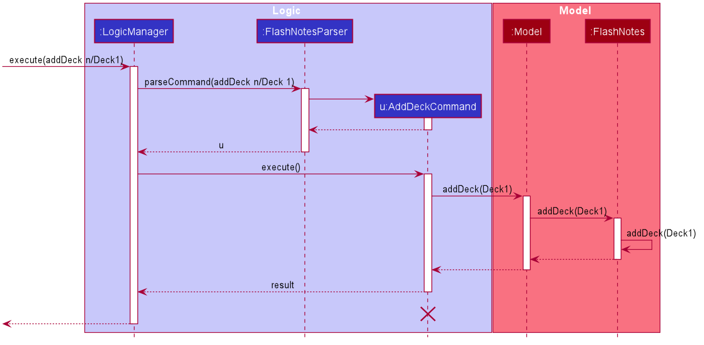

:information_source: **Note:** The lifeline for `addDeckCommand` should end at the destroy marker (X) but due to a limitation of PlantUML, the lifeline reaches the end of diagram.

##### Design Consideration: How Add Deck Command interacts with Model and underlying FlashNotes object
Our team looked at the 2 different ways in which Add Deck Command can interact with model-related objects. 
* **Alternative 1 (current choice):** Add Deck command interacts with the Model and not directly with model’s internal components such as FlashNotes and user prefs.
    * Pros:
        * This also increases maintainability as Add Deck Command only has to be concerned with the methods that Model provides and not the other implementation details should they be subjected to change.
        * This follows the Facade Pattern where the ModelManager acts as the Facade class to the underlying internal Flashnotes object and all other related data components.
        * Consistency of implementation with the other commands in FlashNotes architecture makes it easier for developers to trace and worth the slight increment in abstraction.
    * Cons:
        * Some might view that the ModelManager is taking on too many methods

* **Alternative 2:** Add Deck command interacts with the underlying FlashNotes object directly.
    * Pros:
        * Flashnotes already directly provides the method, hence by reducing the number of function calls, the program may run marginally faster.
    * Cons:
        * Separation of concern principle would be violated. More than 1 object (ModelManager and FlashNotes) are able to interact with commands directly.
        * Increases the number of dependencies on underlying FlashNotes objects and other objects contained in Model, hence reducing testability and maintainability.

As alternative 1 was clearly superior, with the minor drawback of having an additional layer of abstraction, our team chose to keep implementation consistent and continue to interact with model-related objects through Model instead of accessing the underlying objects directly.
Furthermore, the class here may not be considered too heavy with methods since there are only a 2 types of objects involved and hence the cons of using alternative 1 is limited.

#### Listing all flashcards, Reserved Deck Name and Default Deck

The `listAll` command allows Users to enter a list showing all flashcards in FlashNotes.
As the `listAll` command is available on the Main Mode, entering the list of all flashcards will be treated as entering a deck.

In order to differentiate the deck that the user is in, the reserved deck name of "list" is used to inform the model that the user is currently looking at the list of all the cards.

However, in order to allow users to perform card-level operations in the reserved deck "list", any cards created will be sent to the "Default" deck.
Also, to prevent any conflicts with the model, users will not be able to create a deck called "list".

The following activity diagrams summarizes what happens when a user adds a new card:

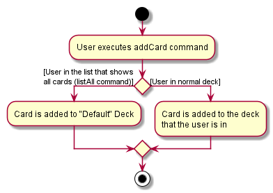

The model has the methods `Model#getDefaultDeckName` and `Model#getReservedDeckName` to retrieve the default and reserved deck names. 
The logic component will reference the these names from the model component during command executions.

##### Design Considerations: How to implement showing all cards.

* **Alternative 1 (current choice):** Allow users to list all flashcards and add flashcards while in this list
    * Pros: User has increased flexibility of adding cards
    * Cons: The system needs to check for reserved deck name 
    
* **Alternative 2:** Prevent users to list all flashcards
    * Pros: The system does not have to check and reserve a deck name or use a default deck name
    * Cons: User will not be able to see a list of all flashcards in FlashNotes
    
* **Alternative 3:** Prevent users from adding flashcards while viewing all flashcards
    * Pros: The system does not have to check and reserve a deck name or use a default deck name
    * Cons: Will have to implement extra logic to block the card level commands while the user is viewing all flashcards

### Implementation of Card Mode Features

Card methods that are supported in Card Mode by `FlashNotes`:
* `FlashNotes#addFlashcard(Flashcard flashcard)`: Adds a flashcard
* `FlashNotes#removeFlashcard(Flashcard key)`: Deletes a flashcard
* `FlashNotes#setFlashcard(Flashcard target, Flashcard editedFlashcard)`: Updates the information of a flashcard

These operations are exposed in the Model interface as `Model#addFlashcard(Flashcard flashcard)`, `Model#deleteFlashcard(Flashcard target)` and `Model#setFlashcard(Flashcard target, Flashcard editedFlashcard) respectively.`

Given below is an example usage scenario.

The user executes `deleteCard 2` to delete the card at index 2 from the observed list.

1. the `deleteCard` command will get the card at the index of the currently displayed list.
1. The `Model#deleteFlashcard(target)` is called.
1. The `ModelManager` will call `FlashNotes#removeFlashcard(key)`
1. Then `FlashNotes` will call the `UniqueFlashcardList#remove(toRemove)`, which will remove the flashcard from the list of flashcards.

The following sequence diagram shows how the `deleteCard` operation works:

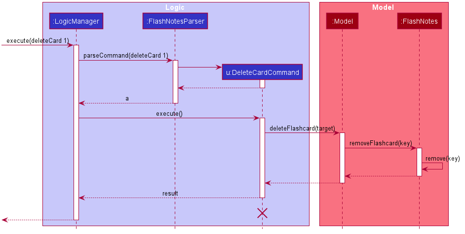

:information_source: **Note:** The lifeline for `deleteCardCommand` should end at the destroy marker (X) but due to a limitation of PlantUML, the lifeline reaches the end of diagram.

##### Design Considerations: How to implement Card Mode Commands

* **Alternative 1 (current choice):** Implement logic of card-level commands in FlashNotes
    * Pros: Easy to implement as all logic for card-level commands is implemented in FlashNotes.
    * Cons: Deck class does not know when the flashcards are modified.
    
* **Alternative 2:** Implement logic of card-level operations in Deck
    * Pros: Deck can modify its own list of flashcards.
    * Cons: Need to redesign the list of flashcards to be a composition of Deck.

### Implementation of Review Mode features 
Our FlashNotes application allows users to test their knowledge and mastery of flashcards through a review session.

#### Opening the review mode
The review session is implemented by opening a new JavaFX window. This new window has its own command box (where users 
type in commands) and result display box (where the application displays messages to the user). On top of that, there is
also the Individual Flashcard section of the window that shows the question of 1 flashcard. When the "flip" command is 
executed, the answer to that question will be showed instead.

The following activity diagram shows the typical workflow when a user reviews flashcards in the review mode.
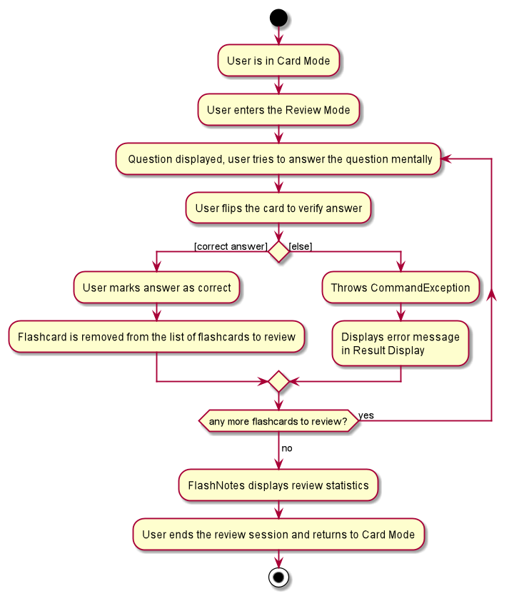

To support the opening of this review session, we added the following command:
* `review` - A command that sets up the list of flashcards to review and opens a new review window displaying those cards.

The following is a sequence diagram that demonstrates how a review command sets up the review session:

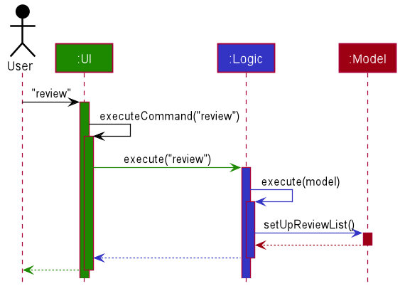

`ModelManager#setUpReviewList()` method sets up the list of flashcards to review inside `Model`.
It duplicates the list of filtered flashcards in the model as of the moment that the review command was
called, it then shuffles these cards using the `FXCollections.shuffle()` method, and it trims the list of
flashcards to review according to the review limit set by users.

#### Setting and Checking Review Limit feature
Our FlashNotes application allows users to set the maximum number of cards that they want to review in a single
review session (review limit). 

Users only have to set the review limit once and it will be saved as user preferences in a storage file. Users will
then only need to use this feature again when they want to change the review limit again in the future.

The initial value for the review limit is set to `Integer.MAX_VALUE` in `preferences.json`, which tells the program that the user did not
set a review limit and hence the program will allow users to review all their flashcards in a certain deck at each review
session. 

The valid range of integer inputs for this command is any integer more than 0. However, as we thought it wouldn't 
make sense on the user's end to set 0 or negative values as the review limit.

The following is an activity diagram showing how the set review command is intended to be used
when a user wants to use FlashNotes to review a deck of flashcards.

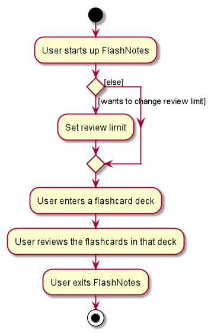

We also implemented a command `checkReviewLimit` for users to check the review limit that they have set, in case they
forgot what the current review limit is.

We stored the review limit using the `long` data type. If we stored the review limit using an `Integer` data type, when 
a user inputs a review limit greater than `Integer.MAX_VALUE`, the program will recognise the review limit as not an Integer
and tell users that the command format is invalid. We solved this problem by storing the review limit using a `long` data type.
Now, when the user inputs a review limit greater than `Integer.MAX_VALUE`, the parser will notice this and throw a relevant 
`ParseException` telling users that their review limit is out of range, instead of telling users that the command format is invalid. 

##### Design Considerations: Where to save the review limit
* **Alternative 1 (current choice):** Save review limit in the user preferences file.
    * Pros: Users would not have to set review limit every time they start up the application.
    * Cons: We have to write to the data file `preferences.json` instead of simply saving the limit as a variable in 
    model.
* **Alternative 2:** Save review limit internally in `Model`.
    * Pros: Do not have to write into a data file.
    * Cons: Users would have to set review limit every time they start up the application.

#### Flip Card feature
Our FlashNotes application allows users to flip the cards they are currently reviewing in the review mode to
see the answer for the question on the flashcard. 

##### Implementation
Users only have to type the `f` command to flip their flashcard. Users can flip the flashcard as many times as they 
would like to in the review mode.

The initial value of `isFlipped` is set to false, so that the review mode is showing the question on the flashcard 
first.

To support the flipping of flashcards, the following commands were added:
* `f` - A command that flips the flashcard currently being reviewed and displays the question or answer depending on 
the number of times the card had been flipped.

The following is a sequence diagram that demonstrates how a flip command flips a card in the review session:
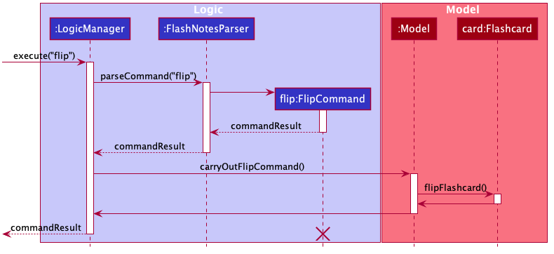

This feature is implemented by adding an isFlipped boolean in the `Model` of the `Flashcard`. To toggle this boolean,
a function call is made from the `ModelManager#carryOutFlipCommand()` which is called by the `FlipCommand#execute()` 
when it is created from the `FlashNotesParser`.

##### Design Considerations: Flip Card Implementation
* **Alternative 1 (current choice):** Change `isFlipped` boolean in the flashcard model.
    * Pros: 
        * Only need the instance of the flashcard to update or check whether the particular flashcard has been 
    flipped in the review mode.
        * Ensures that the logic of flipping of flashcard isn't done in the UI.
    * Cons: Increases coupling.
* **Alternative 2:** Implement the boolean `isFlipped` in the UI part, `IndividualFlashcard`.
    * Pros: No need for extra function calls as flipping is directly done in the UI.
    * Cons:
        * Logic is being done in the UI section.
        * Hard to test using testcases. Have to manually test.
    
#### Next Card feature
Our FlashNotes application allows users to go to the next card to review once they are done reviewing the current 
flashcard.    

##### Implementation
Users only have to type the `c` or `w` command to see the next flashcard where `c` means that they managed to review
the flashcard correctly and `w` means that they got the question wrong. These commands will only work after the user
sees the answer of the flashcard currently being reviewed which is noted by whether the flashcard has been flipped or
not. 

The initial value of `isCorrect` is set to 0 to denote that the card has yet to be reviewed.

To support the ability to go to the next flashcard in the review session, the following commands were added:
* `c` - A command that goes to the next flashcard after marking the flashcard as correct.
* `w` - A command that goes to the next flashcard after marking the flashcard as wrong and adding it back to the review
        list.

The following activity diagram summarizes what happens when a user executes a `c` or `w` command:
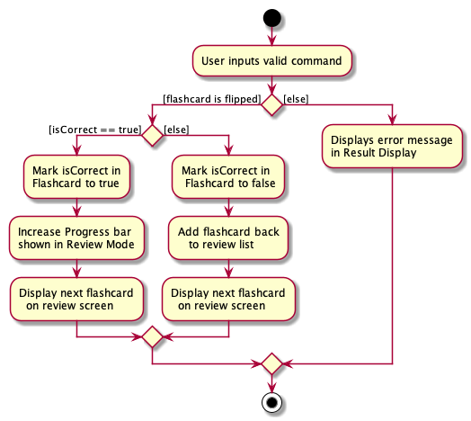

This feature is implemented by adding an isCorrect int in the `Model` of the `Flashcard`. To update this int,
a function call is made from the `ModelManager#markFlashcardBeingReviewed(int result)` which is a call from 
`CorrectCommand#execute()` or `WrongCommand#execute()` when it is created by the `FlashNotesParser`.

Design Considerations for Next Card Implementation are similar to that of Flip Card feature.

#### Review Statistics Feature

FlashNotes application supports testing of the user's knowledge of the flashcards through a review session. 
In addition to this, as a user wants to be able to see how many cards they got correct after a review session, so that
they can track their topics' mastery and feel a sense of accomplishment for studying efficiently (user story). Due to
this user story, FlashNotes will incorporate a review statistics feature to fulfill the user's needs.

##### Tracking and Generation of the Review Statistics Feature

During a review session, FlashNotes will keep track of the number of questions the user answered correctly on their 
first try at the question. In order to compliment the implementation of Review Mode, the implementation made use of the 
addition of `correctAnswers` attribute in `IndividualFlashcard` to keep track of the count of questions answered 
correctly on the first attempt. 

To ensure the variable incrementation is done only if the current flashcard contains a question that the user is attempting
for the first time in the review session, a check in `IndividualFlashcard` for the `index` is done to ensure it is within 
the range of `numOfFlashcards`.

To ensure the variable incrementation is done only if the current flashcard contains a question that the user answered 
correctly, a check is done for the `isCorrect` variable to ensure that the current flashcard has been marked as
correct by the user.

At the end of the review session, FlashNotes will display:
 * `correctAnswers` - The total number of questions marked correct on the user's first attempt at it.
 * `numOfFlashcards` - The total number of unique questions utilized in the review session.
 * A calculated percentage value generated from `correctAnswers` and `numOfFlashcards`.

The calculated percentage value from a review session will be considered as the 'Review Statistics' in FlashNotes.
To provide a measure of accuracy, the percentage value will be calculated as a `double` value, which will be rounded off 
to the nearest 1 decimal place for display or storage purposes.

##### Relationship of Review Statistics and Deck

To further help the user keep track of their topic mastery, FlashNotes will save the calculated percentage from the 
last review session initiated in the deck to the `Deck` class, which will be displayed in the Main Mode of FlashNotes, 
under the relevant Deck's name.

Review Statistics will be saved as the `resultStatistics` attribute as a String in the current `Deck` class 
design implementation. As a String, it can be easily retrieved and displayed to the user through the UI component.
As such, only review sessions initiated from an existing deck will be saved to the relevant deck.

In the event that a user initiated a review session for all of FlashNotes' flashcards, the review statistics will only
be generated and displayed for the user's benefit, but not save to FlashNotes.

##### Extending Storage to Include Deck

Seeing as FlashNotes already saves Flashcard data for the user, it seemed reasonable to expand the storage component to 
save FlashNotes' deck data as well, since it will also allow the user to better track their topic's mastery if they can 
view their last review session's statistic for the deck whenever they open FlashNotes.

###### Design Consideration: Storage Implementation for Deck

* **Alternative 1 (current choice):** Expand the current Storage implementation to include `Deck` data instead of only saving `Flashcard` data.
  * Pros: Partial implementation by teammates already exist.
  * Pros: Implementation can provide base code for future addition to the `Deck` class.
  * Cons: Design and implementation for `Deck` and `UniqueDeckList` is not concrete yet. Changes done now may clash with future changes to the classes.

* **Alternative 2:** Store review statistics as an attribute of Tag
  * Pros: Easier to implement, simply expand tag feature to include review statistics data of the deck that the tag is representing.
  * Cons: Will result in storing several repetitions of the data since it is an add-on to each instance of a unique tag in the json file. This can needlessly take up more space if there are a huge amount of flashcards and only a few decks.  

##### Returning to Card Mode from Review mode

Upon completing the review session, a new command (`endReview`) was added to FlashNotes to allow the user to return to 
the main window of FlashNotes that displays the Card Mode they initiated the review session from. This is to allow the 
user to easily continue using FlashNotes should they wish to leave the Review Mode for any reason.

##### Implementation

To support the above features, the following code changes were added:

A new command have been added to FlashNotes to allow return to Card Mode from Review Mode:
* `endReview` - A command that closes the review session's window at the end of the review session, and handles the ending process of review session. (Only available in review mode.)

To support the storage of each deck's review statistic, a new class has been added to the Storage component in FlashNotes:
* `JsonAdaptedDeck` object contain two variable for Deck Storage, `String deckName` to identify the deck, and `String resultStatistics` to contain the deck's review statistics.
* `JsonAdaptedDeck#updateModel(FlashNotes flashNotes)` is a method used to update the generated model from reading the flashcard data with the deck's data. It depends on `FlashNotes#updateDeckPerformanceScore(Double reviewScore, String deckName)` to update the generated model with the deck data from the save file.

`JsonSerializableFlashNotes` object has been adjusted to depend on a list of `JsonAdaptedDeck` objects to read and write 
each deck's data to the FlashNotes save file.

Additionally, the following operations have been implemented to support the storage of result statistics feature:
* Model component:
    * `FlashNotes#updateDeckPerformanceScore(Double reviewScore, String deckName)` - Updates the reviewStatistics attribute of a specific deck (through `deckName`) with the given Double value (`reviewScore`).
    * `FlashNotes#getUniqueDeckList()` - Return the FlashNotes' model's `UnqiueDeckList`.
    * `UniqueDeckList#findDeck(String deck)` - Returns an existing `Deck` object from its `internalList` with the same `deckName` as the given String input. If no such `Deck` object exist, a `null` object is returned instead.
* UI component:
    * `IndividualFlashcard#displayStatistics()` - Calculates the user's review session's score, updates the model with the generated statistics and update display at the end of the review session.

Further more, the following operations have been adjusted to support the feature:
* `Storage#saveFlashNotes(ReaOnlyFlashNotes flashNotes)` - This operation, and all methods dependent on it, has been expanded to accept an additional parameter `UniqueDeckList decklist` to facilitate the saving of the deck data in FlashNotes.
* `FlashNotes#resetData(ReadOnlyFlashNotes newData)` - This operation has been adjusted to include the recreation of the FlashNotes model's deck data read from Storage.

To provide the UI display and changes related to review statistics, the following UI component have received a few code additions:
* `DeckCard` - Changed constructor method to account for display of review statistics of the last review session in that deck.
* `ReviewWindow#handleExit()` - Adjusted to return to card view upon execution of `endReview` command.

###### Basic Description of the Backend Process of the End of a Review Session:

1. User reaches the end of the review session (by correctly answering the last of the questions that has not been answered yet or has been answered wrongly before). 

1. The UI component will calculate the user's score by generating the percentage of cards the user answered correctly on the first try during the session.

1. The generated review session statistic is conveyed to the Model component, where the `FlashNotes` model updates the relevant deck with the generated value.

1. FlashNotes' UI component will display the review statistics generated as part of the end of review session message.

1. User enters `endReview` command to end the review session.

1. The processing of the `endReview` command through the Parser component will lead to the command execution in Logic component and trigger the save function of FlashNotes, thus updating FlashNote's json file with the new review session statistic for the deck.

###### Corresponding Sequence Diagram for `endReview`:

The following sequence diagram shows how the endReview command operation works:

### Implementation of Critical Classes:

#### Implementation of CommandResult

FlashNotes interacts with users using the `CommandResult` object. When users pass commands into FlashNotes, FlashNotes 
will execute those commands and give users feedback according to the commands passed in. 

`CommandResult` objects are generated when Command objects are executed by the `LogicManager#execute(…)` method. Upon 
generation, all CommandResult objects contain a string `feedbackToUser` which contains success or error messages that will
be shown to the user. This CommandResult object is then passed to UI classes, such as `MainWindow` and `ReviewWindow`. The 
UI classes will then show this `feedbackToUser` in the `ResultDisplay` box.

Upon execution of the Commands, users might request a change of modes, such as moving from Main Mode to Card Mode, or 
Card Mode to Review Mode. This information is passed to the UI classes using the `CommandResult` object too. Some commands
such as the `enterDeck` or `review` will generate a `CommandResult` object with more arguments such as `showHelp`, `exit`,
`startReview`. These arguments will be accessed by UI classes using the public getter methods `CommandResult#isShowHelp()`,
`CommandResult#isExit()` etc. The correct UI screens will be rendered accordingly by respective methods such as 
`DeckCardListRoot#handleExit()`, `ReviewWindow#handleHelp()` etc.

The following class diagram shows how the UI classes are related to the commandResult class, and their relevant methods.

#### Implementation of FlashNotesParser

FlashNotesParser is the overall parser that is used to handle the commands from any of the command boxes in the various modes.

As a result, it needs to be able to take in the commands and also know what are the modes that it is in in order to trigger the correct commands in the 3 different modes.

Note that in our project architecture, the Model component is responsible for storing the state and data related to the application in general. 
FlashNotesParser is purely an object that determines the commands that are accepted based on the current state of the Model's underlying FlashNotes object.

While inside of the `LogicManager#execute(...)` method, the method checks with Model for the booleans related to mode.
Afterwards, FlashNotesParser takes in the mode checking booleans obtained from model in `FlashNotesParser#parseCommand(...)`. 
The booleans regarding the modes enables FlashNotes to be able to decide which of the 3 following methods to use:
* `parseCommandInReviewMode(...)`
* `parseCommandInMainMode(...)`
* `parseCommandInCardMode(...)`

##### Corresponding activity diagram for `FlashNotesParser`:

The following activity diagram shows how the FlashNotesParser works:

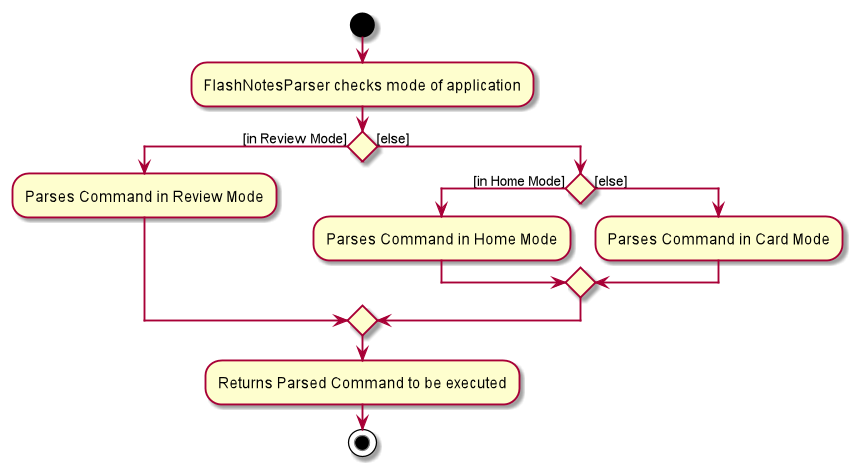

--------------------------------------------------------------------------------------------------------------------

## **Appendix: Requirements**

### Product scope

**Target user profile**:

* NUS FASS student who likes to write down lecture notes
* practices active learning techniques via flash cards
* prefer desktop apps over other types
* can type fast
* prefers typing to mouse interactions
* is reasonably comfortable using CLI apps

**Value proposition**: manage, read and create flashcards faster than a typical mouse/GUI driven app

### User stories

Priorities: High (must have) - `* * *`, Medium (nice to have) - `* *`, Low (unlikely to have) - `*`

| Priority | As a …​                                    | I want to …​                     | So that I can…​                                                        |
| -------- | ------------------------------------------ | ------------------------------ | ---------------------------------------------------------------------- |
| `* * *`  | new user                                   | see usage instructions         | refer to instructions when I forget how to use the App                 |
| `* * *`  | user                                       | add a new deck                 |                                                                        |
| `* * *`  | user                                       | open a deck                    | see what flashcards I have created in that deck so far                 |
| `* * *`  | user                                       | delete a deck                  | get rid of decks of flashcards that I no longer need quickly           |
| `* * `   | user                                       | rename a deck                  | organize my decks better                                               |
| `* * *`  | user                                       | add a new card                 |                                                                        |
| `* * *`  | user                                       | delete a card                  | remove entries that I no longer need                                   |
| `* * *`  | user                                       | find a card by keyword         | locate certain cards without having to go through the entire list      |
| `* * *`  | user                                       | review a deck                  | test my knowledge about the content of the cards in that deck          |
| `* * *`  | user                                       | mark a flashcard as right or wrong | keep track of which cards I have already mastered and which cards I still need to review again |
| `* * *`  | user                                       | see how many cards I got correct after a review session | track my topics mastery and feel a sense of accomplishment for studying efficiently |
| `* `    | user                                       | hide old cards                 | clear clutter when there are too many cards in the deck                |
| `*`      | user with many related cards in the app    | nest the card decks by tags    | locate a cards of the same group easily when reviewing                 |

### Use cases

(For all use cases below, the System is the FlashNotes and the Actor is the user, unless specified otherwise)

##### Use case: UC01 - Create new Deck

**Precondition**: User is in the Main Mode, and is not in review mode.

**MSS:**

1. User creates a new deck.
1. FlashNotes shows the newly created deck.

    Use Case ends.

**Extension:**

* 1a. Deck name already exist.
    * 1a1. FlashNotes shows an error message 
    
    Use case ends.
    
##### Use case: UC02 - Open a Deck

**Precondition**: User is in the Main Mode.

**MSS**

1. User opens a deck
1. FlashNotes shows a list of cards in the deck.

    Use case ends.

**Extensions**

* 1a. User opens a deck that does not exist.
    * 1a.1. FlashNotes shows an error message. 
    
    Use case ends.
    
* 2a. Deck is empty.
    * 2a1. FlashNotes displays an empty list.
    
    Use case ends.
    
##### Use case: UC03 - Delete a Deck

**Precondition**: User is in the Main Mode.

**MSS:**

1. User deletes a deck.
1. FlashNotes deletes the deck and shows the updated list of decks.

    Use Case ends.

**Extension:**

* 2a. Deck does not exist in FlashNotes.
    * 2a1. FlashNotes shows an error message.

    Use Case ends.   
    
##### Use case: UC04 - Rename a Deck

**Precondition**: User is in the Main Mode.

**MSS:**

1. User renames a deck.
1. FlashNotes shows the deck with the new name.

    Use Case ends.

**Extension:**

* 2a. User renames deck to the same name as an already existing deck.
    * 2a1. FlashNotes shows an error message. 
    
    Use Case ends.    
    

##### Use case: UC05 - Show all cards

**Precondition**: User is in the Main Mode.

**MSS:**
1. User requests to see all the cards.
1. FlashNotes shows all the cards to the user.
    
    Use Case ends.

Extensions
    
* 2a. User adds a card.
    * 2a1. FlashNotes adds the card into a default deck.
    
    Use Case ends.

##### Use case: UC06 - Add a card

**Precondition**: User is in Main Mode.

**MSS**

1. User <u>opens a deck (UC02)</u>.
1. User adds a card.
1. FlashNotes adds the card into the current deck.

    Use case ends.

**Extensions**

* 2a. There is a duplicate card.
    * 2a1. FlashNotes shows an error message.
    
    Use case resumes at Step 2.

##### Use case: UC07 - Delete a Card

**Precondition**: User is in the Main Mode, and is not in review mode.

**MSS**

1. User <u>opens a deck (UC02)</u>.
1. User requests to delete a card 
1. FlashNotes deletes the card.

    Use case ends.

**Extensions**
    
* 2a. Card does not exist in FlashNotes.
    * 2a1. FlashNotes shows an error message.
    
    Use case resumes at Step 2.

##### Use case: UC08 - Edit a card

**Precondition**: User is in Main Mode.

**MSS**

1. User <u>opens a deck (UC02)</u>.
1. User requests to edit a specific card in the deck.
1. FlashNotes edits the card.

    Use case ends.

**Extensions**

* 2a. Card does not exist in FlashNotes.
    * 2a1. FlashNotes shows an error message.
    
    Use case resumes at step 2.
    

##### Use case: UC09 - Find keywords in card

**Precondition**: User is in Main Mode.

**MSS**
1. User <u>opens a deck (UC02)</u>.
1. User searches for keyword(s) of cards in the deck.
1. FlashNotes shows the cards that contain the keyword in the question.

    Use case ends.

**Extensions**
* 2a. The keyword does not exist in any card.
    * 2a1. FlashNotes shows an empty list.
    
    Use case ends.
    
##### Use case: UC10 - Seeing a list of cards in the deck

**Precondition**: User is in Card mode.

**MSS**
1. User <u>find for cards using keyword(s) (UC09)</u>.
1. User requests to see a list of cards in the deck again.
1. FlashNotes shows the list of all cards in the deck again.

    Use case ends.

##### Use case: UC11 - Return to Main Mode

**Precondition**: User is in Card mode.

**MSS:**

1. User requests to return to Main Mode.
1. FlashNotes shows the list of decks to the user.

    Use Case ends.

##### Use case: UC12 - Review cards

**Precondition**: User is in Main Mode.

**MSS:**

1. User <u>opens a deck (UC02)</u>.
1. User requests to start a review on the cards shown.
1. FlashNotes starts a review session.
1. FlashNotes displays a card with only the question to the user.
1. User flips the card to see the answer.
1. FlashNotes displays the answer to the user.
1. User marks the card as correct or wrong.
1. Repeat steps 3 to 6 until there are no more cards.
1. FlashNotes displays the statistics of the review. 
1. User ends the review.
1. FlashNotes returns User back to the original page.

    Use case ends.

**Extension:**

* 7a. User correct remembers the answer of the flashcard.
    * 7a1. User marks the card as correct.
    * 7a2. FlashNotes shows next card.
    
   Use case resumes from Step 4.

* 7b. User unable to remember the correct answer of the flashcard.
   * 7b1. User marks card as wrong.
   * 7b2. FlashNotes adds card back into the lists of card to be reviewed again.
   * 7b3. FlashNotes shows the next card.
   
   Use case resumes from Step 4.

* *a. User ends the review session prematurely.
    * *a1. FlashNotes does not show user the Review statistics.
    * *a2. FlashNotes does not update the Review statistics of the deck reviewed.
    
    Use case resumes from Step 10.

### Non-Functional Requirements

1.  Should work on any _mainstream OS_ as long as it has Java `11` or above installed.
2.  Should be able to hold up to 1000 cards without a noticeable sluggishness in performance for typical usage.
3.  A user with above average typing speed for regular English text (i.e. not code, not system admin commands) should be able to accomplish most of the tasks faster using commands than using the mouse.
4.  Interactions should not take more than 2 seconds.
5.  The user can directly edit the data file.
6.  Should be usable by someone not used to CLI.

### Glossary

* **Mainstream OS**: Windows, Linux, Unix, OS-X
* **FlashNotes**: The software that stores flashcards and decks.
* **Flashcard**: A card with a question and answer.
* **Deck**: A collection of flashcards.
* **Main Mode**: A mode which displays a list of decks
* **Card Mode**: A mode which displays a list of cards
* **Review Mode**: The mode in which users can navigate through flashcards to review, and test their knowledge on the content of those cards.
* **Tag**: A note to indicate which deck the card belongs to.
* **Review card limit**: The maximum number of cards that can be reviewed in a single review session.

--------------------------------------------------------------------------------------------------------------------

## **Appendix: Instructions for manual testing**

Given below are instructions to test the app manually.

:information_source: **Note:** These instructions only provide a starting point for testers to work on;
testers are expected to do more *exploratory* testing.

### Launch and shutdown

1. Initial launch

   1. Download the jar file and copy into an empty folder.

   2. Double-click the jar file Expected: Shows the GUI with a set of sample flashcards. The window size may not be optimum.

1. Saving window preferences

   1. Resize the window to an optimum size. Move the window to a different location. Close the window.

   2. Re-launch the app by double-clicking the jar file.  
        Expected: The most recent window size and location is retained.
       
### Creating a deck

1. Creating a deck.

    1. Prerequisites: User is in Main mode.
    
    1. Test case: `addDeck n/Economics`  
        Expected: Creates a new empty deck called 'Economics' and adds it to the list of decks displayed.

### Editing a deck name

1. Editing a deck name.
    
   1. Prerequisites: User is in Main Mode and FlashNotes contains a deck called "Economics" at index 1 and a deck called "Singapore.
   
   1. Test case: `editDeckName 1 n/Econs` 
        Expected: The name of deck at Index 1 is changed to Econs.
        
   2. Test case: `editDeckName 1 n/Singapore`  
        Expected: Deck name at index 1 is not changed. Error message is shown that the deck "Singapore" already exists.

### Deleting a deck

1. Deleting a deck.

   1. Prerequisites: User is in Main mode and FlashNotes contains at least one deck.
   
   2. Test case: `deleteDeck 1`  
        Expected: First deck is deleted from the list.
   
   3. Test case: `deleteDeck 0`  
        Expected: No deck is deleted. Error details shown in the status message. 

### Setting and checking the review card limit

1. Setting the maximum number of cards that can be reviewed in a single review session.

    1. Prerequisites: User is in Home screen or Card screen.
    
    1. Test case: `setReviewLimit 20`  
       Expected: The message "Review card limit successfully updated! Review limit is now 20." should appear in the result display box.
       
    1. Test case: `setReviewLimit 0`  
       Expected: The message "Review card limit must be an integer greater than 0 and smaller than 2147483648." should appear in the result display box.
        
    1. Test case: `setReviewLimit all`  
       Expected: The message "Review card limit successfully updated! There is now no review limit." should appear in the result display box.
       
    1. Test case: `setReviewLimit 20` from the review window  
       Expected: The message "This command is not available in review mode. Please exit the review mode by typing 'endReview' and try again." should appear in the result display box.

1. Checking the maximum number of cards that can be reviewed in a single review session.

    1. Prerequisites: User is in Home screen or Card screen.
    
    1. Test case: `checkReviewLimit`  
       Expected: The message "Review card limit is 20!" should appear in the result display box. (assuming review limit is 20)
       
    1. Test case: `checkReviewLimit 7`  
       Expected: The message "This command contains more arguments than necessary. Please try the command again without any arguments: checkReviewLimit" should appear in the result display box.

### Entering a deck

1. Entering a deck.

   1. Prerequisites: Flashnotes have decks with names 'Singapore' and 'Malaysia'.
    
   2. Test case: `enterDeck Singapore`  
       Expected: All cards with the tag 'Singapore' will be shown. Cards with tags 'Malaysia' will not be shown.    
    
   3. Test case: `enterDeck singapore`  
       Expected: None of the cards are shown (as the keyword is case-sensitive). 

   4. Test case: `enterDeck Singapore Malaysia`  
       Expected: No cards are shown as there is no deck with a name 'Singapore Malaysia'.   

### Listing all flashcards
1. Shows a list of all flashcards, and enters card mode.

    1. Prerequisites: User is in Home mode.
    
    2. Test case: `listAll`  
        Expected: The newly rendered list of flashcards can be seen. The list contains all flashcards currently stored 
        in FlashNotes irrespective of the deck.

### Adding a card

1. Adding a card in a normal deck created by user.

    1. Prerequisites: Enter a deck using the command `enterDeck DECK_NAME`. 
    
    2. Test case: `addCard q/question1 a/answer1`  
        Expected: The specified card is added and shown to the user.
        
1. Adding a card while in the list of all flashcards.
    
    1. Prerequisites: Enter the list of all flashcards using the command `listAll`.
    
    2. Test case: `addCard q/question1 a/answer1`  
        Expected: The flashcard is added to the list of flashcards shown.
        The specified card is added to a deck called "Default". 
        The "Default" deck will be created in the Main Mode if the deck does not exists.       

### Editing a card

1. Editing a card while in card mode.

    1. Prerequisites: User is in Card Mode with at least one card in the list.
    
    2. Test case: `editCard 2 a/Lee Kuan Yew`  
        Expected: The answer for the second card is changed to 'Lee Kuan Yew'.
        
    3. Test case: `editCard 2 q/Who is Singapore's prime minister? a/Lee Hsien Loong`  
        Expected: The question for the second card is changed to 'Who is Singapore's prime minister?' and the answer 
        is changed to 'Lee Hsien Loong'.
        
    4. Test case: `editCard 0 q/Who is Singapore's prime minister?` 
        Expected: No card is edited. Error details shown.

### Deleting a card

1. Deleting a card in card mode.

   1. Prerequisites: User is in Card Mode with at least one card in the list.

   2. Test case: `deleteCard 1` 
      Expected: First card is deleted from the list. Details of the deleted card shown in the status message.

   3. Test case: `deleteCard 0` 
      Expected: No card is deleted. Error details shown in the status message.

   4. Other incorrect delete commands to try: `deleteCard`, `deleteCard x`, `...` (where x is larger than the list size) 
      Expected: Similar to previous.   
      
### Finding a flashcard

1. Finding a flashcard in Card mode.

    1. Prerequisites: User is in Card mode. 
    
    1. Test case: `find history`  
        Expected: The flashcard(s) with questions that contain the word 'history' will be displayed.
        
### Listing all flashcards in card mode

1. List flashcards in Card Mode.

    1. Prerequisites: User is in Card Mode. User has successfully executed the find command.
    
    1. Test case: `list`  
        Expected: User will go back to the deck of cards they were viewing before they executed the find command.

### Going back home

1. Going back to Main Mode from Card Mode.
    
    1. Prerequisites: User is in card mode.
    
    1. Test case: `home`  
       Expected: The list of orange decks in the Main Mode can now be seen.

### Reviewing a deck of cards

1. Opening the review window.

    1. Prerequisites: User is in card screen.
    
    1. Test case: `review`  
       Expected: A new window should pop up containing a command box, result display, and the question on the first flashcard.
    
    1. Test case: `review 7`  
       Expected: The message "This command contains more arguments than necessary. Please try the command again without any arguments: review" should appear in the result display box.
        
1. Flipping a card that is being reviewed.

    1. Prerequisites: User is in review mode, and the review session is still ongoing.
    
    1. Test case: `f` when the card is showing the question 
        Expected: The card should be flipped to show the answer for this question.
        
    1. Test case: `f` when the card is showing the answer  
        Expected: The card should be flipped to show the question for this answer.

1. Marking flashcard that is being reviewed as correct.

    1. Prerequisites: User is in review mode, and the review session is still ongoing.
    
    1. Test case: `c` when the card is showing the question 
        Expected: Error Message to indicate that the card should be flipped first before it can be marked as correct.
    
    1. Test case: `c` when the card is showing the answer  
        Expected: If the card wasn't the last card in the list, it should show the question of the next card and the progress in the progress bar should increase. Otherwise, it should show the review statistics.

1. Marking flashcard that is being reviewed as wrong.

    1. Prerequisites: User is in review mode, and the review session is still ongoing.
    
    1. Test case: `w` when the card is showing the question 
        Expected: Error Message to indicate that the card should be flipped first before it can be marked as wrong.
    
    1. Test case: `w` when the card is showing the answer  
        Expected: It should show the question of the next card and the progress bar should still have the same progress.
        
1. Ending a review session.

    1. Prerequisites: User is in review mode.
    
    1. Test case: `endReview`  
       Expected: Review Window closes, and you are returned to the Card Mode you started the review session from.

-------------------------------------------------------------------------------------------------------------------

## **Appendix: Effort**

### Challenge 1: UI Modes
At first, the AddressBook3 (AB3) only had 1 interface for users, which is the Main Window that shows a list of people and 
their details. When developing our flashcard application, we thought that **users should be able to separate their flashcards into
separate decks**, and also to **review their flashcards in a different place** from where they make/edit their flashcards. We struggled
with finding a good way to allow users to perform all these actions using the single interface that came with AB3. 

The easiest method we explored to achieve this was to modify the `list` command to let users view their flashcards in specific 
decks, and show the cards one by one when users want to review them. However, we were not satisfied with the visual effect of 
this solution. We wanted to let users **differentiate their interactions when making/editing the decks and flashcards, and when 
reviewing flashcards more clearly**.

The next method we explored required far more effort but was worth it in the end. We **decided to implement 3 different interfaces** 
for our application, the *Main* mode, the *Card* mode, and the *Review* mode. **Different commands are allowed** in the different modes. 
In the main mode, the different decks would be displayed to the users. Users can then make new decks or edit current decks in 
this mode. They can also choose a specific deck to open and see the cards it contains. This brings users into the Card mode, 
where they can make new flashcards or edit current cards. They can also review their cards by using the review command that brings 
them to the review mode. 

Implementing this required us to **redesign the entire UI component** into something with more layers of 
abstraction and complexity. In doing so, we encountered some problems with the GUI settings not being saved properly and also 
sizing issues with different windows on different operating systems. However, we managed to resolve them in the and ultimately, 
we ended up with a **highly effective and user-friendly** flashcard application.

### Challenge 2: One object type versus Two object types with a perceived composition relationship

At the start of our team project, refactoring AB3 into FlashNotes resulting in the `Person` object changing into 
the `Flashcard` object. As out project progressed, there was a need to include a second object, which was the `Deck`
object in the Model component of FlashNotes. Our team faced several challenges with our choice to implement the `Deck` class.

Due to the perceived composition relationship between `Deck` and `Flashcard` and the chosen design for `Deck` implementation, 
commands that result in the change of a `Deck` object (e.g. editting deck name or deleting a deck) meant that there was 
a need to look through all of the `Flashcard` objects in FlashNotes to carry out the necessary changes regarding the `Deck`
object depending on the command issued.

On top of that, as part of our **Review Statistics Feature**, we wanted to be able to save the data in the `Deck` class as well. 
To support this, we had to expand the old Storage implementation from AB3 to include the addition of the data in the
`Deck` class. 

To prevent confusion, there was a need to ensure the implementation saved all the decks' data in FlashNotes
to the existing save file used for the `Flashcard` data. This was a challenge as not only did we need to implement new 
methods and classes to facilitate the saving of `Deck` data to the `flashnotes.json` save file, we also had to make 
adjustments to existing code, so that we will be able accurately read in the newly stored `Deck` data from the save file
whenever FlashNotes is launched.

### Challenge 3: Increment of the number of accessible features

There are at least 4 accessible commands in each of the three modes of FlashNotes, in comparison to the 7 total commands in AB3.
 * Main Mode has 10 accessible commands unique to it.
 * Card Mode has at least 10 accessible commands unique to it.
 * Review Mode has 4 accessible commands unique to it.
 
Refer to the [User Guide's Command Summary](https://ay2021s1-cs2103t-t15-2.github.io/tp/UserGuide.html#command-summary)
section for the entire listing of all the commands.

### Achievement of Project

1. User story - Of the 13 [User Stories](https://ay2021s1-cs2103t-t15-2.github.io/tp/DeveloperGuide.html#user-stories) 
listed, we managed to fulfill 12 of them in various ways.

1. Maintain the simplicity and cohesiveness of the features from the original AB3 project.

1. Provided extensive unit and manual testing on the product, making it reliable and efficient for production usage.

