## Introduction
Welcome to the FlashNotes User Guide.

FlashNotes is a **desktop app for text-based flashcards**, built for students who wish to utilise English flashcards for studying. FlashNotes is also optimized for use via a Command Line Interface (CLI) while still having the benefits of a Graphical User Interface (GUI). If you can type fast, FlashNotes will be faster than traditional GUI apps.

Flashcards are one of the oldest forms of studying methods, but it is also remarkably difficult to keep track of the vast amount of content to study for. However, with FlashNotes, you can now keep track of your flashcards and their content with ease.
FlashNotes allows you to organise your flashcards by topics or subjects using Decks. 

FlashNotes utilises a studying technique known as [Active Recall](https://en.wikipedia.org/wiki/Active_recall), allowing you to test yourself using flashcards to check if you have mastered your content.
Furthermore, FlashNotes will also keep track of your progress and show you an overview of how well you have mastered your content using flashcards.

This User Guide is for user who have no prior knowledge on how to create and review flashcards using FlashNotes. We will teach you how create and manage your flashcards more efficiently, and how to review your flashcards for studying using FlashNotes. 
We will provide you with all the various features and commands of FlashNotes, and its details. 

To get started, head over to the [Quick Start](#quick-start) section.

To see the summary of all our commands, go to the [Command Summary](#command-summary) section.

Here's the Table of Contents for a brief overview of our User Guide, or for you to quickly access other sections of our User Guide.

--------------------------------------------------------------------------------------------------------------------

* Table of Contents
{:toc}

--------------------------------------------------------------------------------------------------------------------

## Glossary

* **Flashcard**: A flashcard shows a question and the answer to the question.
* **Decks**: A deck will contain flashcards.
* **Index**: The number at the start of each deck or flashcard.
* **Review**: A mode where only the question of the flashcard is shown; the answer will be hidden from you.
* **Prefix**: A reserved word that needs to be placed before your inputs to indicate the start of your input.
* :information_source:: Additional info
* :warning:: Warning

## Understanding the 3 different modes:
FlashNotes has 3 different modes, the main mode, card mode and review mode. Each mode has its own set of valid commands.  
You will always start in the Main Mode when you open FlashNotes.

### Mode 1: Main Mode
Contains a list of decks of flashcards.  

Users can: 
* View a list of decks
* Create, edit and delete decks
* Open a deck to view flashcards in it (Enters card mode)
* List all flashcards from all decks
* Clear all decks
* Set maximum number of cards to review
* View User Guide
* Exit the program

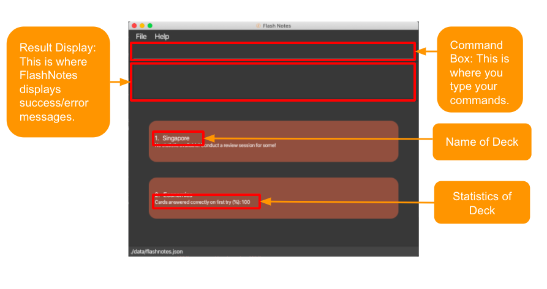 

### Mode 2: Card Mode
Contains a list of flashcards.
  
Users can:
* Create, edit and delete flashcards
* Find flashcards by question
* Set maximum number of cards to review
* Start a review session
* Return to main mode
* View User Guide
* Exit the program

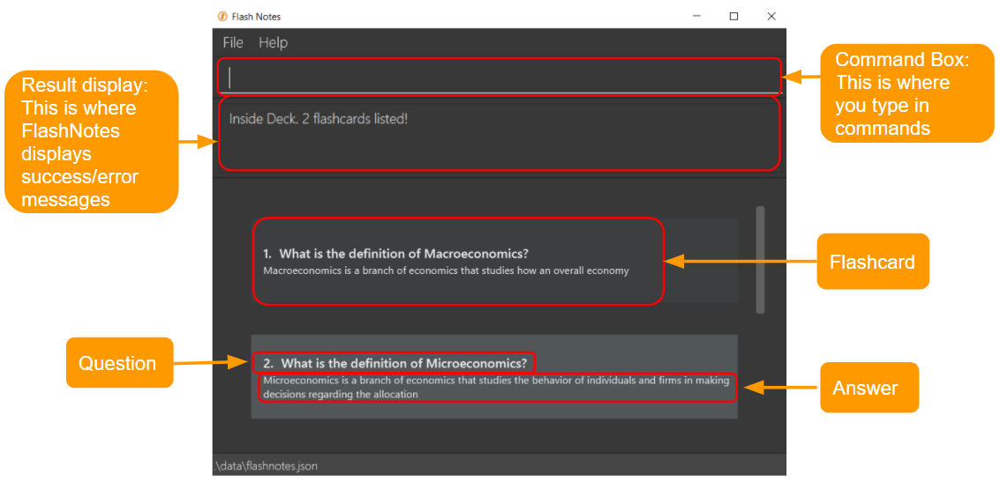 

### Mode 3: Review Mode
Displays flashcards one at a time for users to review.
  
Users can:
* Flip the flashcard to view the answer
* Mark a flashcard as correct or wrong to review the next card
* View statistics at the end of the review session

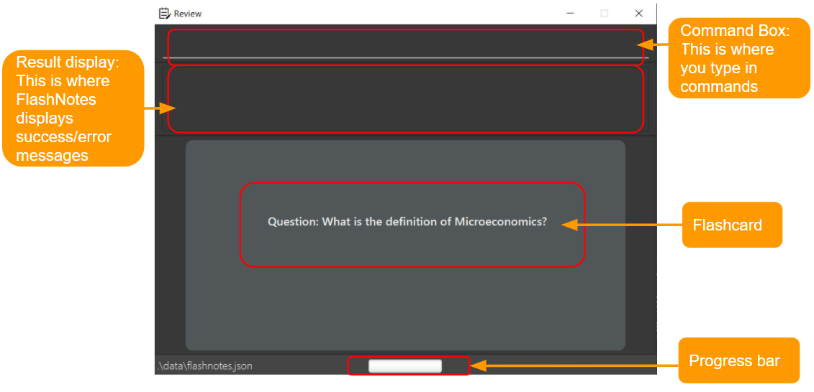
 
--------------------------------------------------------------------------------------------------------------------

## Quick start

1. Ensure you have Java `11` or above installed in your Computer.

1. Download the latest version of `flashnotes.jar` from [here](https://github.com/AY2021S1-T15-2/tp/releases).

1. Copy the file to the folder you want to use as the _home folder_ for your FlashNotes.

1. For Mac Users:  

    * Open your 'System Preferences'
    
    * Click on 'Security & Privacy'
    
    * Click on 'Privacy' tab and click on 'Input Monitoring' section
    
    * Enable java to monitor input from your keyboard even while using other apps as shown in the image below.
    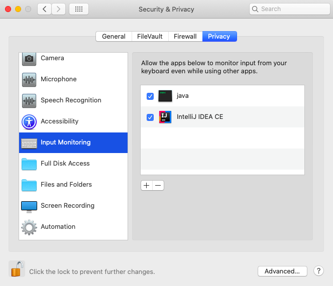 

1. Double-click the file to start the app. A view similar to the one below should appear in a few seconds. Note how FlashNotes contains some sample data after initial launch. 
   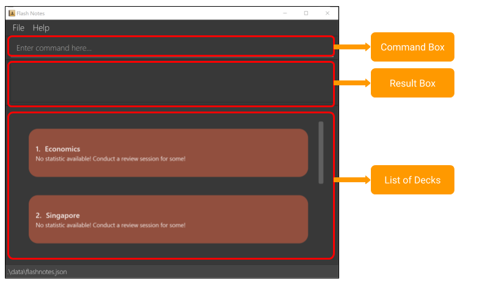 
   
   * **Command Box**: Where you input commands for FlashNotes.
   
   * **Result Box**: Where FlashNotes displays the resulting message to your last input in the Command Box.
   
   * **List of Decks**: Displayed list of decks currently in FlashNotes.

1. Type a command in the **Command Box** and press Enter to execute it. Some example commands you can try are:

   * **`addDeck`**`n/Languages `: Creates a new (empty) Deck named 'Languages'.

   * **`listAll`** : Lists all available flashcards in FlashNotes.

   * **`clear`** : Deletes all cards.

   * **`help`** : Opens the Help window.

   * **`enterDeck`**`Singapore `: Lists all cards inside the deck 'Singapore'.

   * **`exit`** : Exits the app.

1. After executing each command, a success or failure message will be displayed in the **Result Box**. This will let you know if you have successfully executed the relevant commands or not. Given that you have provided the correct command prefixes, it can even provide additional information on why your command has failed.   

1. Refer to the **Features** section below for the details of each command.

   
   **:information_source: About the sample data:** 
   
   Initial launch of FlashNotes will result in the application loading in with our provided sample data. This is to accommodate first-time users wishing to familiarize themselves with FlashNotes before using it in-depth.
    
   Our provided sample data is not accurate nor necessary to the application. As such, you can easily delete the sample data in the following way:
   
   * Usage of the `clear` command. 
     Clears all flashcard and deck data currently in FlashNotes. Refer to [Main Mode Features](#main-mode-features) for further details about the command.
     

--------------------------------------------------------------------------------------------------------------------

## Explanation of Command Formats used in features

**:information_source: Notes about the command format:** 

* Words in `UPPER_CASE` are the inputs to be supplied by you. 
  e.g. in `addCard q/QUESTION a/ANSWER`, `QUESTION` is an input which can be `What is the question?`.

* Inputs can be in any order. 
  e.g. if the command specifies `q/QUESTION a/ANSWER`, `a/ANSWER q/QUESTION` is also acceptable.
  
 * Inputs in square brackets `[ ]` represent optional inputs for the command.

--------------------------------------------------------------------------------------------------------------------

## Main Mode Features

**:information_source: Quick Summary of Main Mode:** 

* Main Mode primarily allows management of flashcard decks.
* In order to manage flashcards directly, you will need to enter card mode using the `enterDeck` Command.

### Entering a specified deck: `enterDeck`

Enters card mode and shows your flashcards within your chosen deck.

Format: `enterDeck DECKNAME`

Examples:
* `enterDeck Economics` return cards stored in the deck `Economics`

Outcome expected:

1. Enter the Enter Deck command into the command bar.
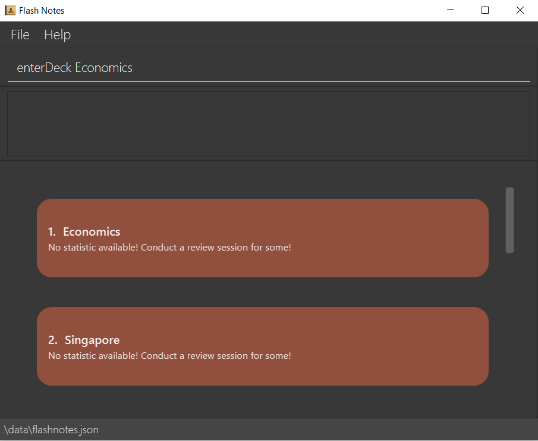

1. You will see the list of cards stored in the deck named Economics. The result display will also show the number of cards in the list.
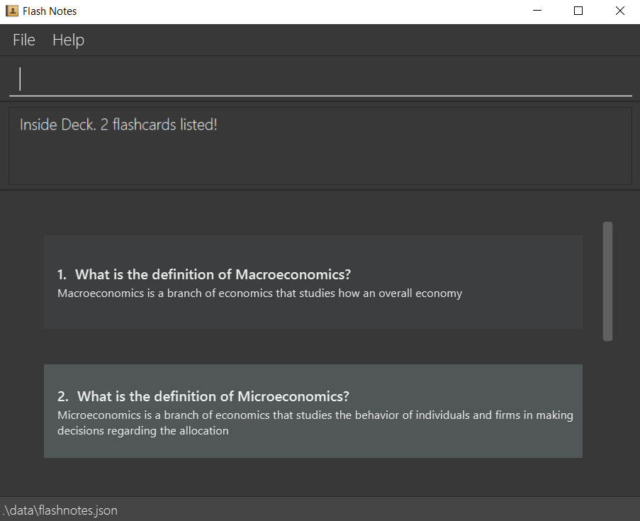

:warning: Things to note:

* The deck name entered is **case-sensitive**. e.g. `GET1025` will not match `get1025`
* Only **full phrases** will be matched with the relevant decks e.g. `GE` will not match `GET1025`

### Create a new Deck : `addDeck`

Creates a new empty deck and adds to the list of decks displayed.

Format: `addDeck n/DECKNAME`

Examples:
* `addDeck n/Singapore History` creates an empty deck called `Singapore History`.

Outcome expected:
1. Enter the Add Deck Command into the command bar as per the example.
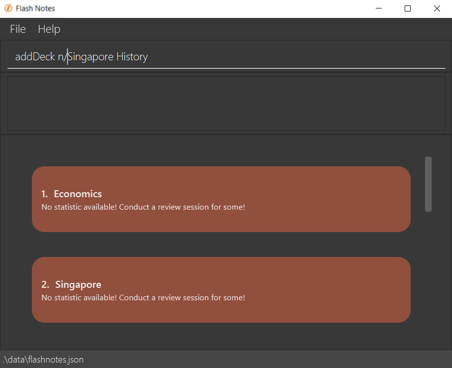

1. You should see the newly rendered list of decks. If there are more decks than the screen can fit, scroll down to find your newly created deck. It will be the last one in the list.
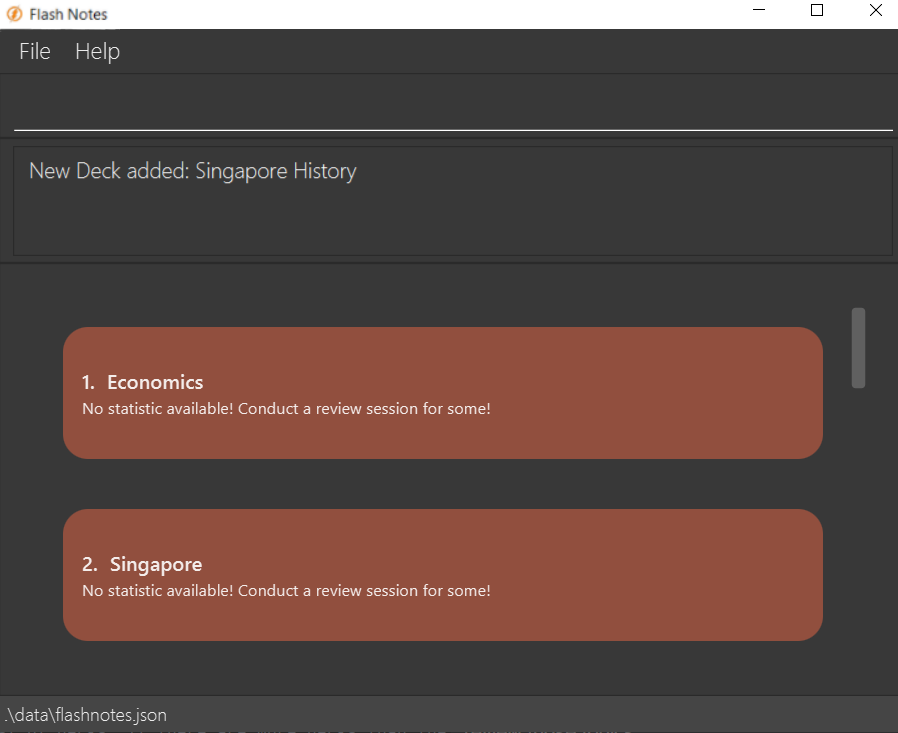

1. After scrolling down, you will be able to see your newly created deck. It is empty though, waiting for you to fill it up with meaningful flashcards!
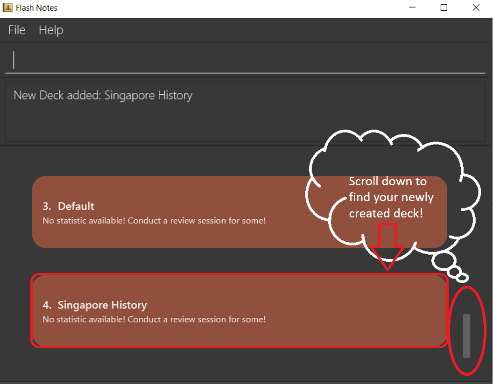

:warning: Things to note:

* The deck name is **case-sensitive**. e.g. `GET1025` will not match `get1025`
* If there is a deck that has the **same existing** case-sensitive name, the deck will not be created because it would be considered a duplicate deck by the system.
* There is a **40 character limit** for `DECKNAME`.
* Reserved names (such as `list`) can't be used as `DECKNAME`.
* If multiple name prefixes are in the command text, only the last one would be selected.
* If you are in *Card* mode, you need to navigate back to the *Main* Mode via the Home command before adding new deck.

### Rename a new Deck : `editDeckName`

Edit a deck name and the tags of all corresponding cards in the deck. 
Note that all cards' tag correspond to the deck that they belong to.

Format: `editDeckName INDEX n/NEWDECKNAME`

Example:
* `editDeckName 1 n/History` will change the name of the deck at index `1` to `History`.

Outcome Expected:

1\. Enter the Edit Deck Name command (`editDeckName 1 n/History`) into the command bar as shown in the example. The name of the deck at index 1 will be edited.
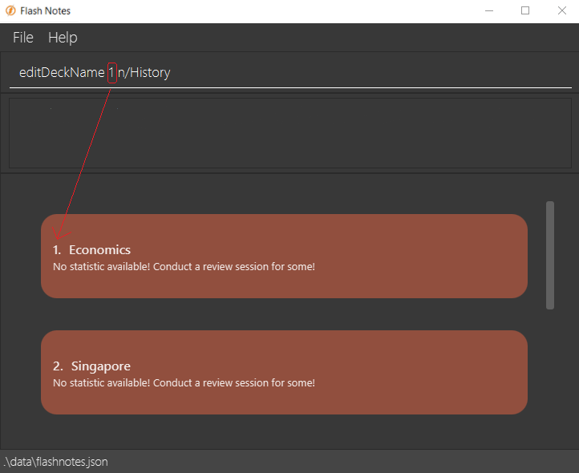

2\. When successful, you will see that the name of the deck at index 1 has been changed to History.
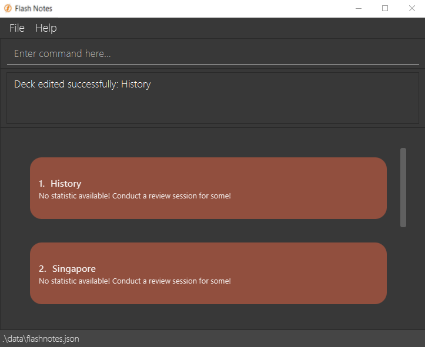

:warning: Things to note:

* Edits the deck at the specified `INDEX`
* The index refers to the index number shown in the currently displayed list of decks.
* The index **must be a positive integer** 1, 2, 3, …​
* The `NEWDECKNAME` is case-sensitive.
* The `NEWDECKNAME` should not be a name that already exists as a deck.

### Delete a new Deck : `deleteDeck`

Deletes the deck and all the associated cards in your specified deck.

Format: `deleteDeck INDEX`

Example:
* `deleteDeck 3` will delete the deck at index 3 and all its corresponding cards.

Outcome Expected:

1\. Enter the deleteDeck command (`deleteDeck 3`) into the command box as shown in the example. The deck at the index 3 will be deleted.
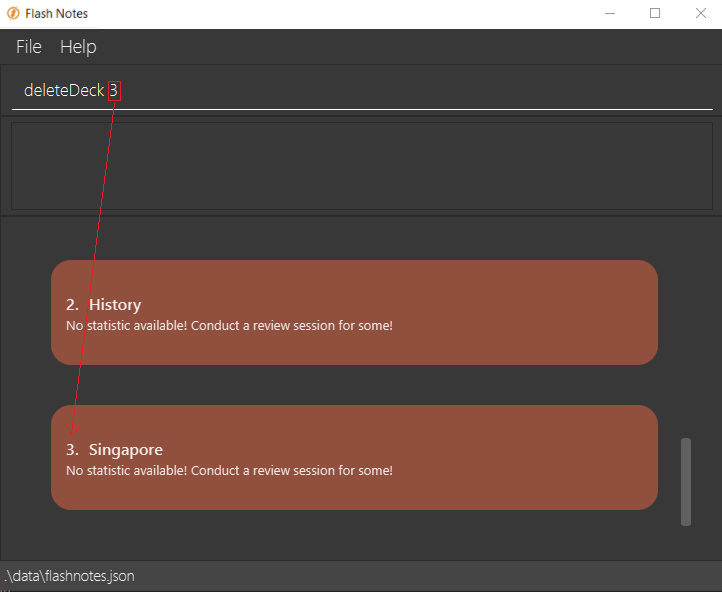

2\. The deck at index 3 has been deleted and you will be shown the remaining set of decks (if any).
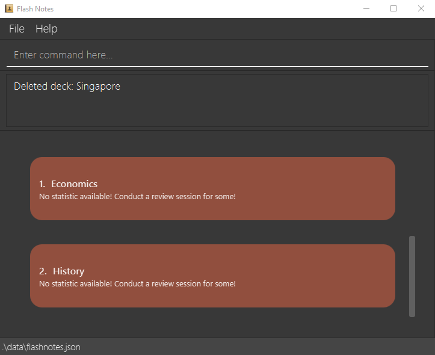

:warning: Things to note:

* Deletes the deck at the specified `INDEX`
* The index refers to the index number shown in the currently displayed list of decks.
* The index **must be a positive integer** 1, 2, 3, …​

### List all flashcards : `listAll`

Shows a list of all flashcards, and enters card mode.

Format: `listAll`

Outcome Expected:
1. Enter the `listAll` Command into the command bar as per the example.

1. You should see the newly rendered list of flashcards. The list contains all flashcards currently stored in FlashNotes irrespective of the deck.
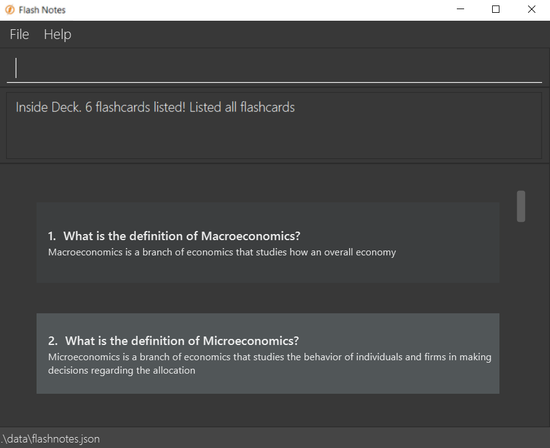

:warning: Things to note:

* Any cards added while in the list mode will be added to the `Default` deck.
* No additional inputs should be added behind the `listAll` command.
* Note that starting a review in this screen will not attribute the review results to any deck. It will not be stored at the end of the review session.

### Set card limit for review session : `setReviewLimit`

Sets the maximum number of cards that can be reviewed in a single review session.
 
If the review card limit is greater than or equal to the number of cards in the deck you want to review:
* Eg. Review limit is 20 while there are 10 cards in the deck, then all the cards in the deck will be 
shuffled and put in the queue for you to review in the review window.

If the review card limit is smaller than the number of cards in the deck you want to review:
* Eg. review limit is 3 while there are 10 cards in the deck, then 3 cards will be randomly chosen 
from the deck and put in the queue for you to review in the review window. 

Format: `setReviewLimit REVIEW_LIMIT`

Examples:
* `setReviewLimit 20` sets a limit of 20 cards per review session.
* `setReviewLimit all` removes the card limit and lets you review all cards in the deck.

Outcome Expected:
1. Enter the `setReviewLimit` command with the review limit you want into the command box as shown. 
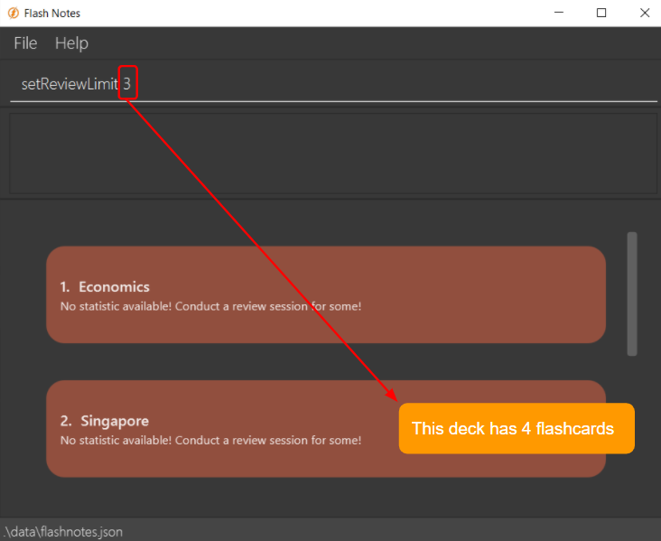

1. When successful, the following success message will be displayed.
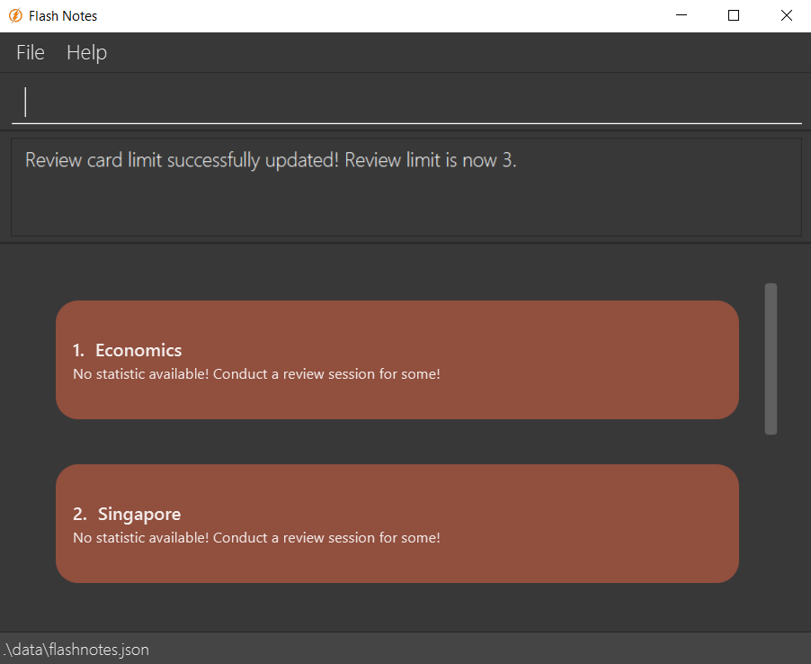

1. You can check that the review limit is indeed 3 by entering the commands
`enterDeck Singapore` (which contains 4 flashcards in total) and type `review`.
(3 flashcards will be chosen randomly from the deck of 4 cards) Use the `f` and `c` commands to review the flashcards. 
After reviewing the 3rd flashcard, you should have reached the end of the review session as shown below.
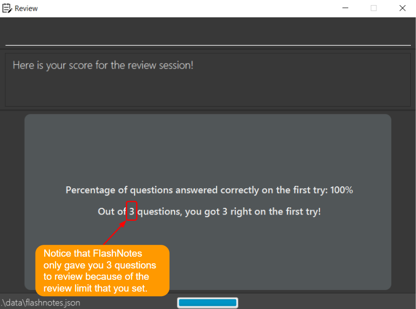

1. When an invalid review limit is entered, the following error message will be displayed.
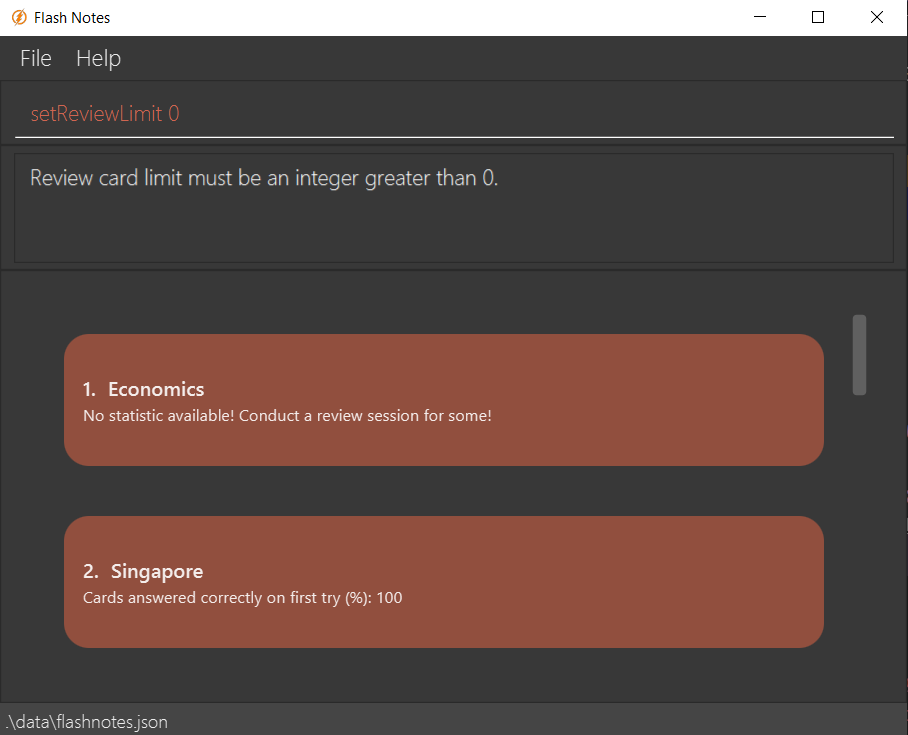

:warning: Things to note:

* The review limit can be an **integer greater than 0 and smaller than 2147483648**. The program doesn't handle any
review limit greater than 2147483647.
* The review limit can be the string `all`. (case-insensitive)
* Note that when the review limit is set to `all`, the review limit is maximum number of cards you can review.
(Which is 2147483647 cards)
* This review card limit **applies to all decks** once it is set. 
* This review card limit is **remembered by the program**. (You do not have to set the card limit 
again after he/she closes and reopens the application)
* This command be used in both the *Main* and *Card* modes.

### Check card limit for review session : `checkReviewLimit`

Checks the maximum number of cards that can be reviewed in a single review session.

Format: `checkReviewLimit`

Examples:
* `checkReviewLimit` 

Outcome Expected:
1. Enter the `checkReviewLimit` command into the command box as shown below. 
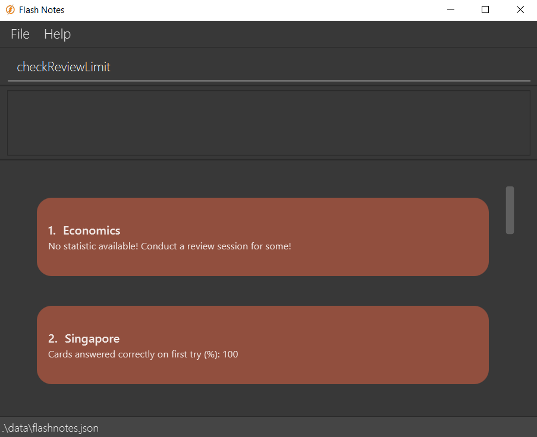

1. When successful, the following success message will be displayed.
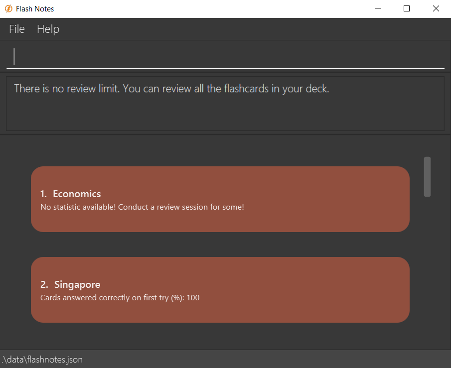

:warning: Things to note:

* This review card limit **applies to all decks**. 
* This review card limit is **remembered by the program**. (You do not have to set the card limit 
again after he/she closes and reopens the application)
* This command be used in both the *Main* and *Card* modes.

### Viewing help : `help`

Shows a message explaining how to access the help page.

Format: `help`

Outcome Expected:
1. The help window will show you the link to our user guide.
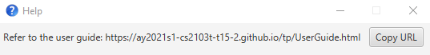

:warning: Things to note:

* This command be used in the *Main*, *Card* and *Review* modes.

### Clear all cards and decks : `clear`

Clears all decks and flashcards from the program.

Format: `clear`

Outcome Expected:
1. Enter the Clear Command into the command bar as per the example.
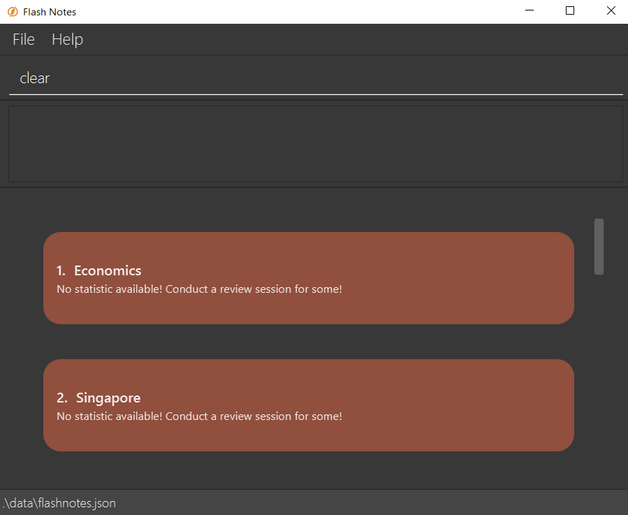

1. You should now see that FlashNotes is empty.
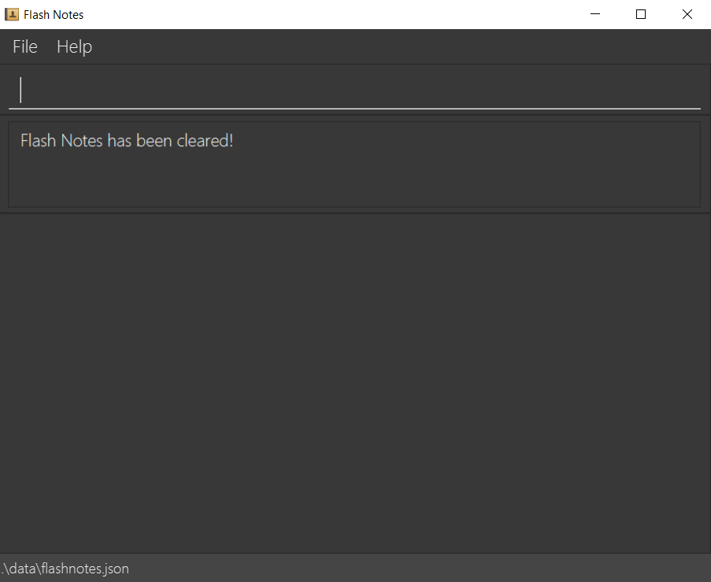

:warning: Things to note:

* All cards and decks will be cleared.
* No additional inputs should be added behind the clear command.
* There is no undo command available in the system presently. Hence, the clear command is irreversible.

### Exiting the program : `exit`

Exits FlashNotes.

Format: `exit`

Outcome Expected:
1. User enters `exit` command in *Main* Mode.  
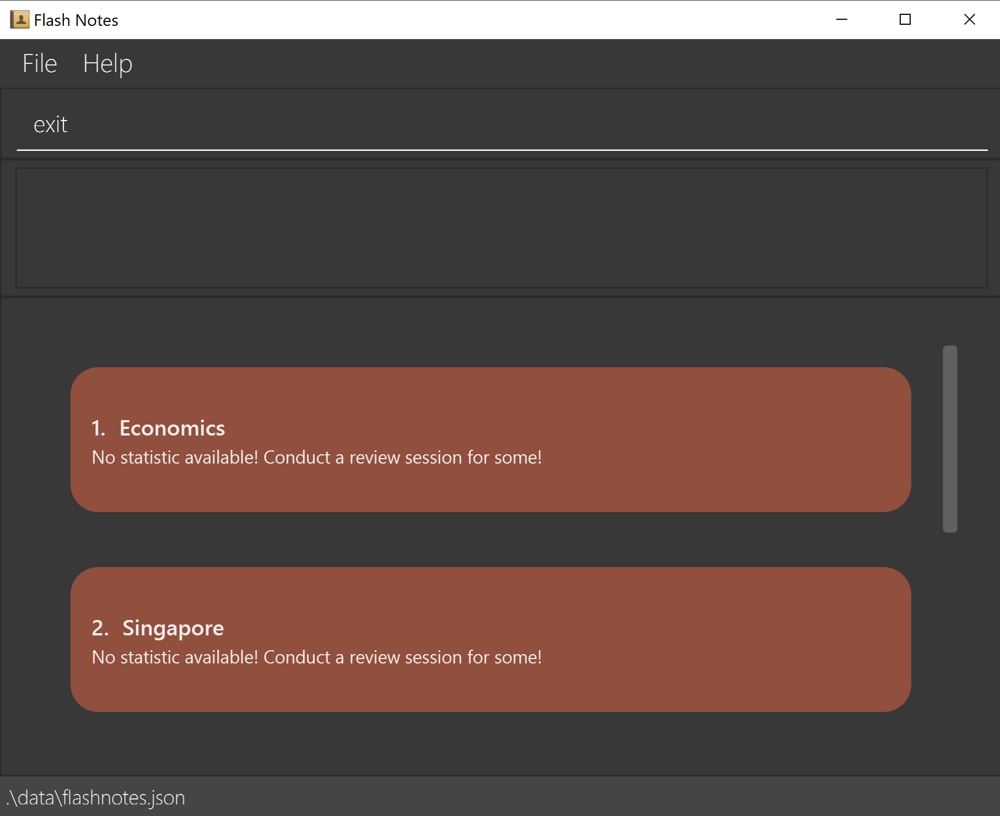

1. FlashNotes closes and saves all current data.

:warning: Things to note:

* `exit` can be activated from *Main* Mode and *Card* Mode, but not *Review* Mode.
* No additional inputs should be added behind the `exit` command.

### Saving the data

FlashNotes saves its data into hard disk automatically after every command,  so there is no need to save its data manually.

The data of FlashNotes is contained in the `flashnotes.json` file. This saved file can be found in the `data` folder contained inside of the folder that you installed FlashNotes into.

For further details on how to transfer FlashNotes data, please refer to the [FAQ](#faq) section.

--------------------------------------------------------------------------------------------------------------------

## Card Mode Features

**:information_source: Quick Summary of Card Mode:** 

* Card Mode primarily allows management of flashcards.
* In order to manage decks directly, need to return to main mode via home command.

### Adding a flashcard : `addCard`

Adds a card to the currently stored notes.

Format: `addCard q/QUESTION a/ANSWER`

Example:
* `addCard q/Who was Singapore's First President? a/Yusok Ishak`

Outcome Expected:

1\. Enter the addCard Command into the command box as shown. The question will precede after the prefix `q/` and the answer will precede after the prefix `a/`. 
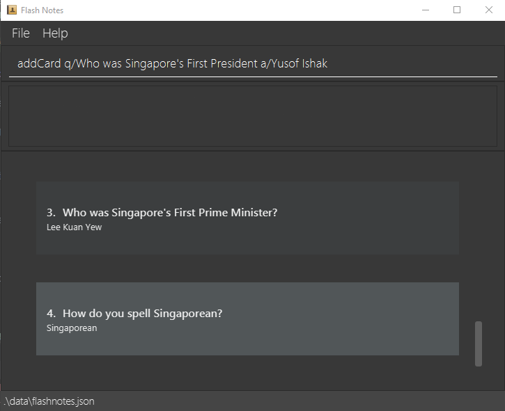

2\. When successful, you will see the newly added flashcard at the bottom of the list.
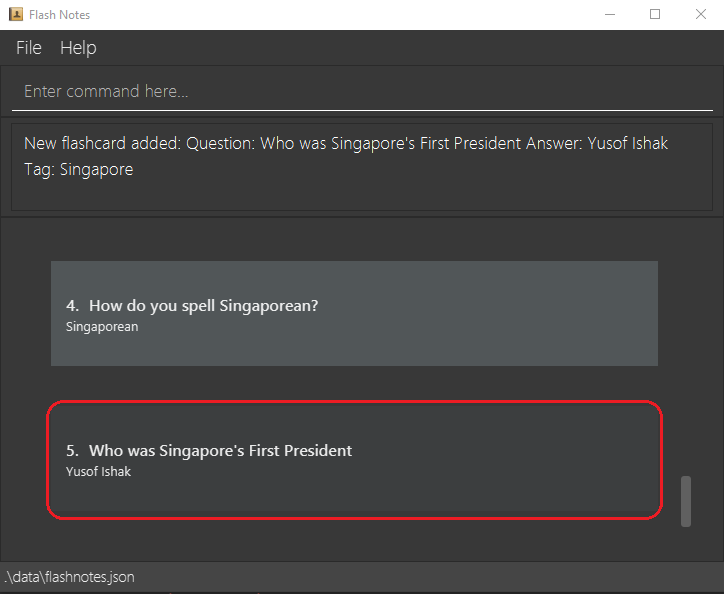

:warning: Things to note:

* There is a 140 character limit for QUESTION and ANSWER.

### Editing a flashcard : `editCard`

Edits an existing flashcard in the flashcard deck.

Format: `editCard INDEX [q/QUESTION] [a/ANSWER] [t/TAG]`

Examples:
*  `editCard 2 a/Lee Kuan Yew` Edits the answer of the 2nd flashcard to be `Lee Kuan Yew`

Outcome Expected:
1. Initial view of card mode.  
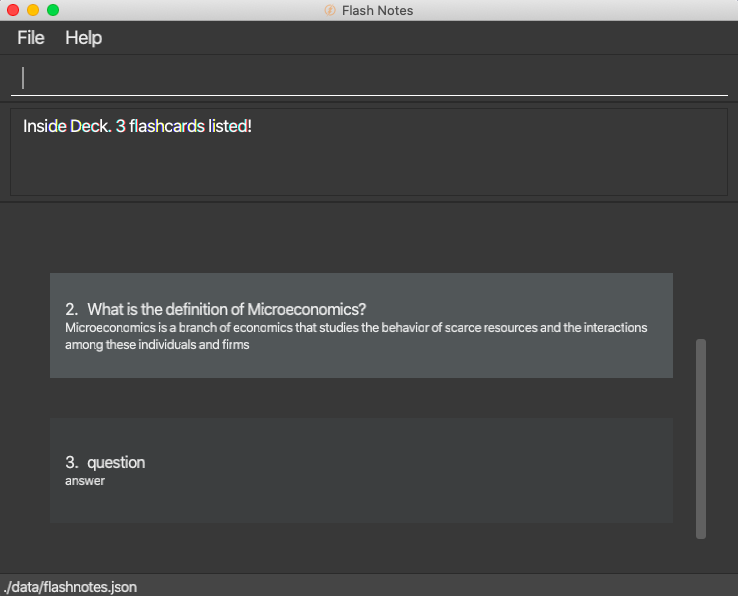

1. Type `editCard INDEX [q/QUESTION] [a/ANSWER]` into the command box and enter.  
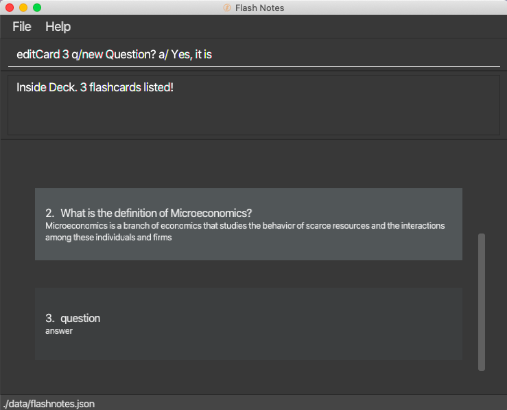

1. The result of executing the editCard command. The question and answer of the selected flashcard would have 
changed.  
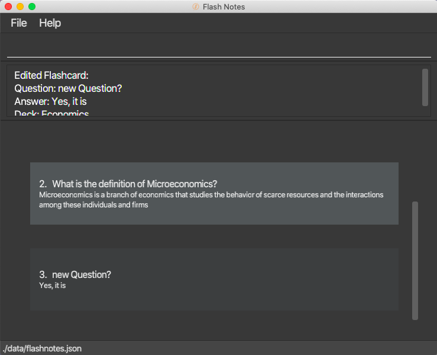

:warning: Things to note:

* Edits the flashcard at the specified `INDEX`. The index refers to the index number shown in the displayed desk list. The index **must be a positive integer** 1, 2, 3, …​
* At least one of the optional fields must be provided.
* Existing values will be updated to the input values.
* Note that editing the tag of the card will cause the card to move to the Deck with the name exactly as per the new tag name.
* `TAG` refers to the deck which the card belongs to.
* When the `TAG` of the card is edited into a tag/deck that does not exist yet, FlashNotes will create that deck and place the flashcard into that deck.

### Finding flashcards : `find`

Finds flashcards which contain any of the given keywords in their respective questions. 
Find returns full word matches, excluding punctuation.

Format: `find KEYWORD [MORE_KEYWORDS]`

Examples:
* `find history` returns `History of WWII` and `History of Cuban war of Independence`
* `find Business` returns `Business Management`
* `find conflict resolution` returns `Handling Conflict` and `Resolution`

Outcome Expected:
1. Enter the find Command into the command box as shown. 
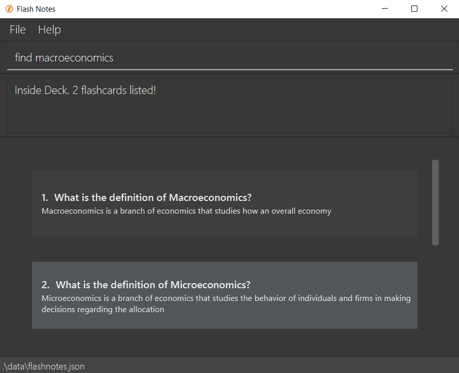

1. When successful, the flashcard(s) with questions that contains the matching keywords will be displayed.
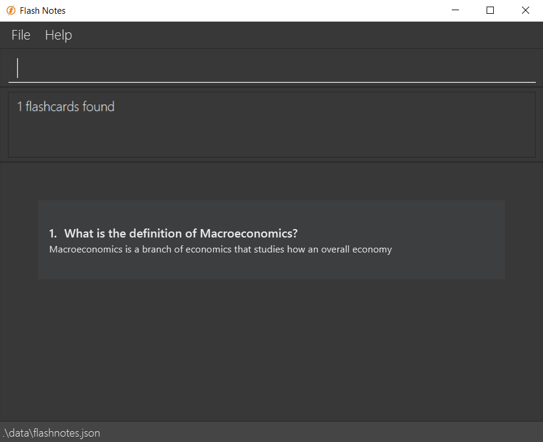

:warning: Things to note:

* The search is **case-insensitive**. e.g `test` will match `Test`
* **Only full phrases will be matched** e.g. `Art` will not match `Artifact`
* Find command only **searches keywords from the questions**, since the purpose of using flashcards is to self test.
* Flashcards matching at least one keyword will be returned. (e.g. `Conflict Resolution` will return `Handling Conflict`, `Resolution`)

### Listing all flashcards in a deck: `list`

Lists all flashcards in the deck.

format: `list`

Outcome Expected:
Shows all flashcards in the deck that the user is in.

:warning: Things to note:

* No additional inputs should be added behind the `list` command.
* Typically used after the `find` command when you want to see all cards in the deck again.

### Deleting a flashcard : `deleteCard`

Deletes the specified flashcard from the flashcard deck.

Format: `deleteCard INDEX`

Examples:
* `list` followed by `deleteCard 2` deletes the 2nd flashcard from the flashcard deck.
* `find English` followed by `deleteCard 1` deletes the 1st flashcard shown in the results of the `find` command.

Outcome Expected:
1. Enter the `deleteCard` Command with the `INDEX` of the flashcard to delete into the command box as shown. 
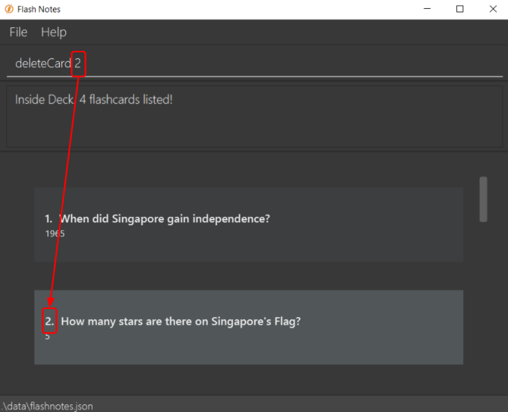

1. When successful, the flashcard(s) matching the `INDEX` specified will be deleted.
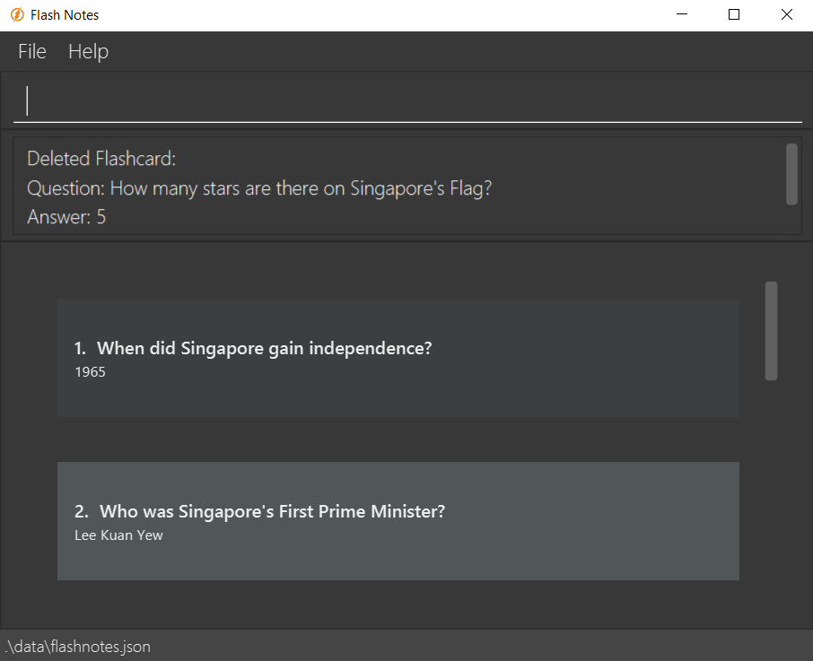

1. If an invalid `INDEX` is specified, the following error message will be displayed.
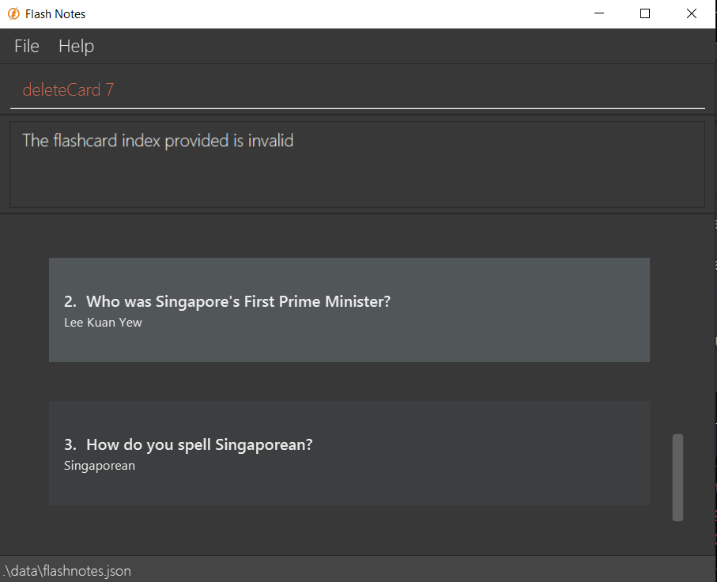

:warning: Things to note:

* Deletes the flashcard at the specified `INDEX`.
* The index refers to the index number shown in the currently displayed list of flashcards
* The index **must be a positive integer** 1, 2, 3, …

### Return to Main Mode : `home`

Return to Main mode with list of decks.

Format: `home`

Outcome Expected:
1. Enter the Home Command into the command bar as per the example.

1. You should now see the list of orange decks in the Main Mode.
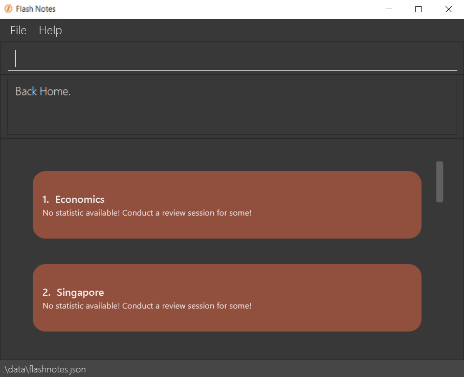

:warning: Things to note:

* It can only be activated from the *Card* mode to navigate back to *Main* Mode.
* No additional inputs should be added behind the home command.

### Opens the review mode: `review`

Opens the review mode to display cards one by one so that you can review them.

Format: `review`

Outcome Expected:
1. Enter the `review` command.
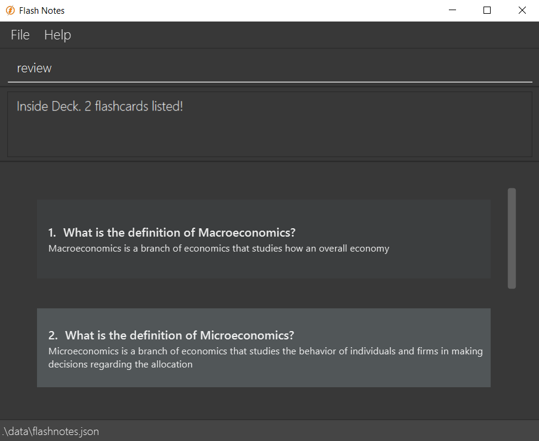

1. When successful, a new review window will pop up and the command box of the main window will be disabled until the
review window is closed.

1. When the `review` command is called in an empty deck, the following error message will be shown.
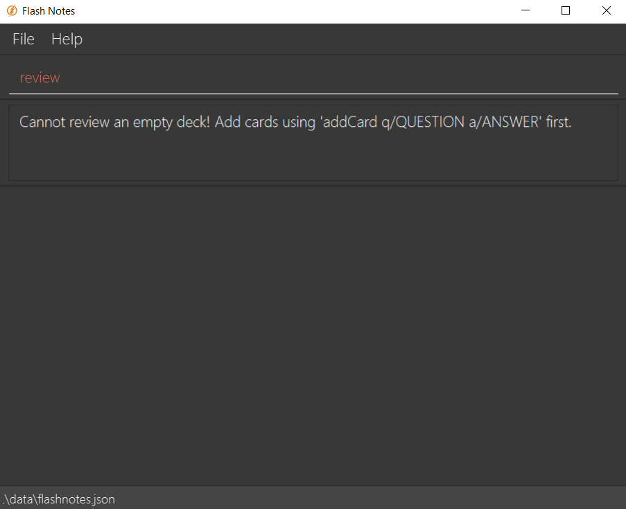

:warning: Things to note:

* This command is only valid in the *Card* mode.
* The cards to be reviewed is determined by the list of cards currently displayed in the *Card* mode.
(Eg. If there were originally 10 cards in the deck, and you use the `find` command to search for specific cards. 
If only 1 card matches your search query, and you use the `review` command, only that 1 card will be reviewed.
To review all the 10 cards in the deck, you can use the `list` command to display all cards in the *Card* mode
again before using the `review` command.)
* You should not be able to maximize the review window.

--------------------------------------------------------------------------------------------------------------------

## Review Mode Features

**:information_source: Quick Summary of Review Mode:** 

* Review Mode primarily allows active flashcards to be used for revision.
* It also provides relevant statistics upon completion of review session.
* Enter Review mode by calling `review` command in card mode.

### Flip a flashcard: `f`

Flips the flashcard which is being reviewed so that you can view the answer to the question.

Format: `f`

Examples:
* `f` returns `The sea is blue because water absorbs colors in the red part of the light spectrum` 
 which is the answer to the question `Why is the sea blue?`.

Outcome Expected:
1. Initial view of flashcard.  
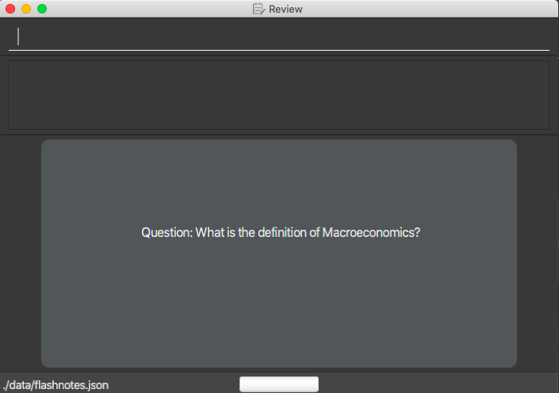

1. Type `f` into the command box and enter.  

1. The result after flip command has been executed. The answer to the question can now be seen.  
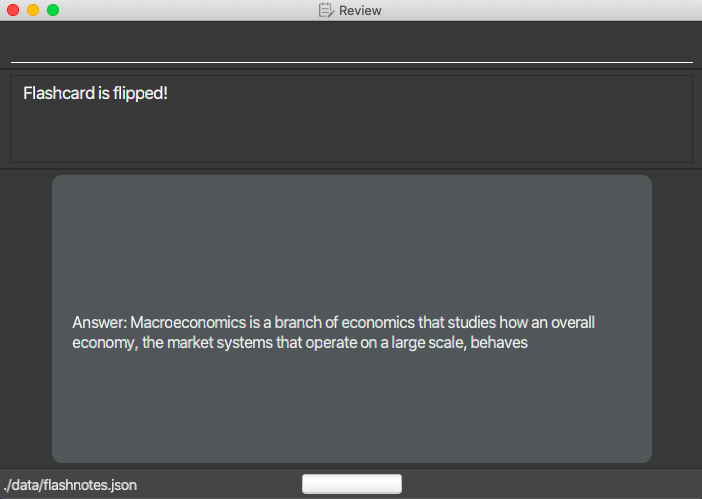

1. Type `f` into the command box again and enter to flip the card again.  

1. The result after flip command has been executed. The question is now visible instead of the answer.  
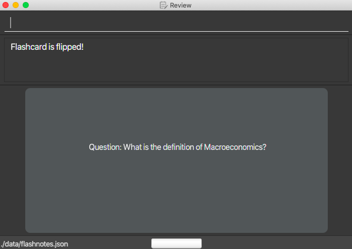

:warning: Things to note:

* Flashcard can be flipped as many times as the user wants, to alternate between the question and the answer.
 
 

### Mark a flashcard as correct: `c`

Marks the flashcard that is being reviewed as correct and proceeds to show the next flashcard.

Format: `c`

Examples:
* `c` returns next card in deck if any.

Outcome Expected:
1. Initial view of flashcard that has been flipped.  
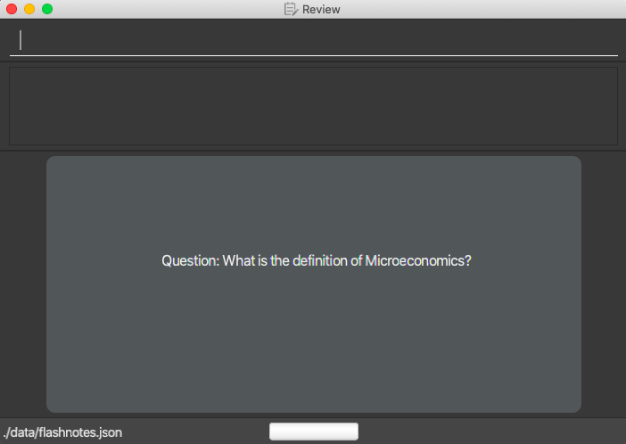

1. Type `c` into the command box and enter to mark the flashcard as correct.  

1. The result after the correct command has been executed. The next flashcard will be shown and the progress bar will 
show an increase in progress.  
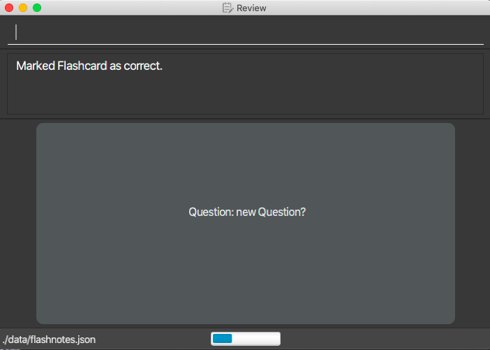

Possible Error users might encounter:
1. Typing `c` into the command box when flashcard has not been flipped.  
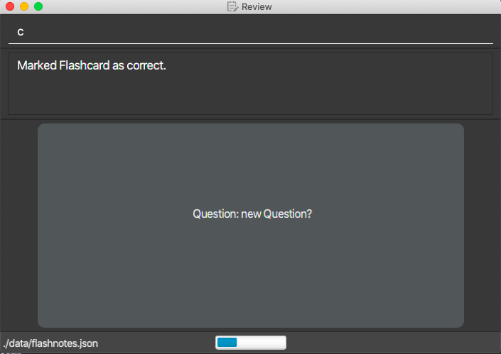

1. Error message telling users to flip the card first before marking the card, is shown in the result display.  

1. Type `f` into the command box and enter.  

1. The result after flip command has been executed. The Answer to the question can now be seen.  
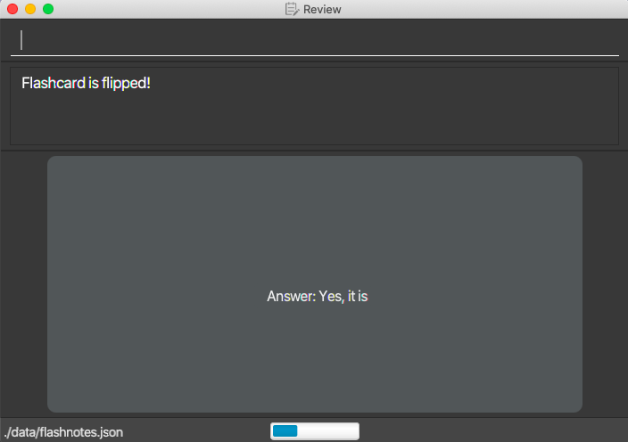

1. Type `c` into the command box and enter to mark the flashcard as correct.  

1. The result after the correct command has been executed. The next flashcard will be shown and the progress bar will 
   show an increase in progress.  
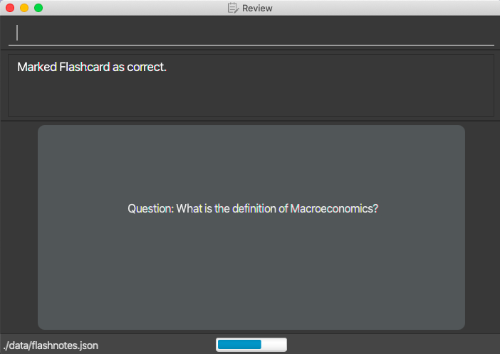

:warning: Things to note:

* Flashcard can only be marked as correct after the card has been flipped to show the answer.
* Even if the user has flipped to view the answer, and flips back to view the question, the user has to 
flip back to the answer again before they can mark the flashcard as correct.
* Flipping the flashcard even number of times will result in the question to be shown, and hence the flashcard cannot
 be marked in this case.
 
 

### Mark a flashcard as wrong: `w`

Marks the flashcard that is being reviewed as wrong and proceeds to show the next flashcard.

Format: `w`

* Marks flashcard as wrong before moving on to show the question of the next flashcard.

Examples:
* `w` returns next card in deck if any.

Outcome Expected:  
1. Initial view of flashcard that has been flipped.  
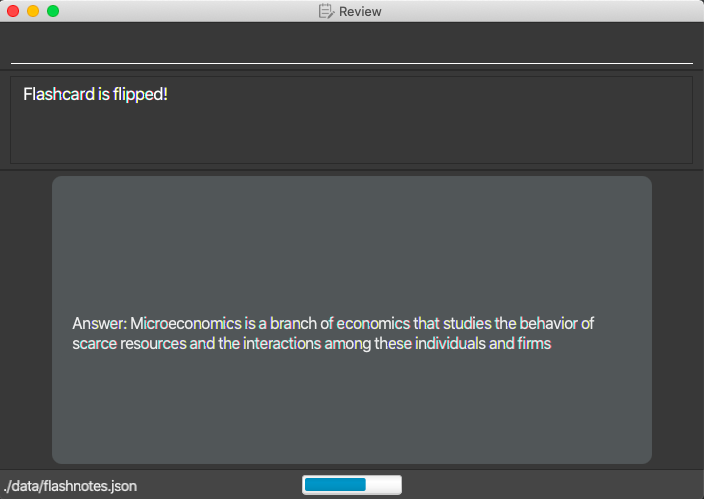

1. Type `w` into the command box and enter to mark the flashcard as wrong.  
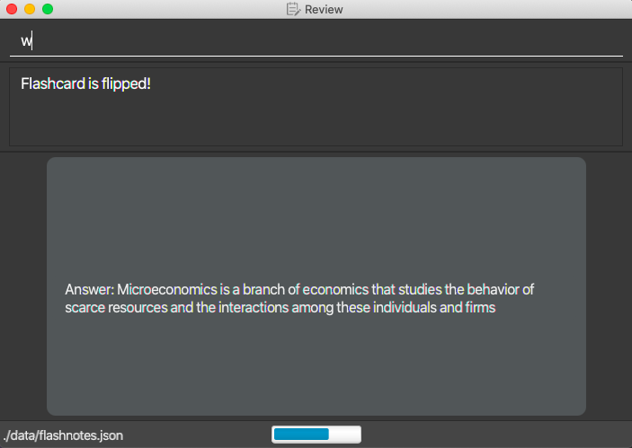

1. The result after the wrong command has been executed. The next flashcard will be shown.  
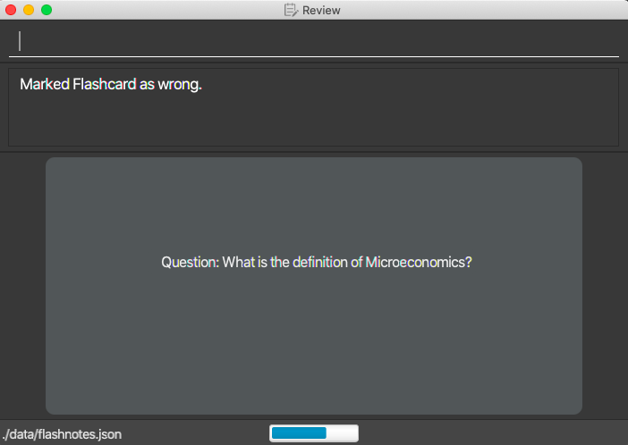

Possible Error users might encounter:
1. Typing `w` into the command box when flashcard has not been flipped.  

1. Error message telling users to flip the card first before marking the card, is shown in the result display.  
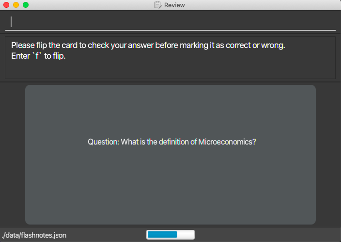

1. Type `f` into the command box and enter.  
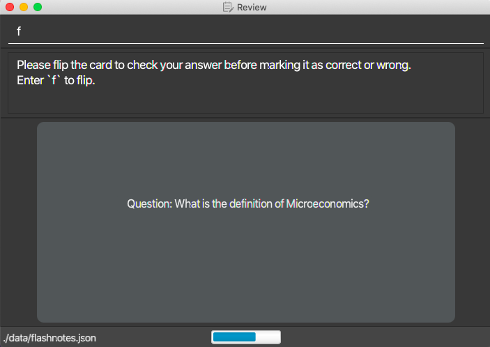

1. The result after flip command has been executed. The Answer to the question can now be seen.  

1. Type `w` into the command box and enter to mark the flashcard as wrong.  
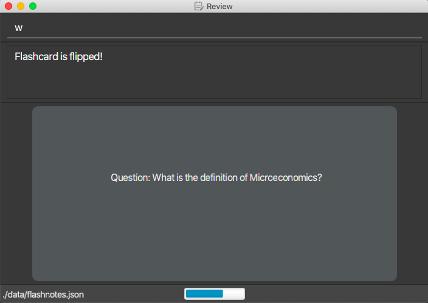

1. The result after the wrong command has been executed. The next flashcard will be shown.  
 

:warning: Things to note:

* Flashcard can only be marked as wrong after the card has been flipped to show the answer.
* Even if the user has flipped to view the answer, and flips back to view the question, the user has to 
flip back to the answer again before they can mark the flashcard as wrong.
* Flipping the flashcard even number of times will result in the question to be shown, and hence the flashcard cannot
 be marked in this case.
 
 

### End current review session: `endReview`

Ends the current review session and returns you to the *Card* Mode that the review session started from.

Format: `endReview`

Outcome Expected:  
1. User has reached the end of the review session and entered the `endReview` command.  
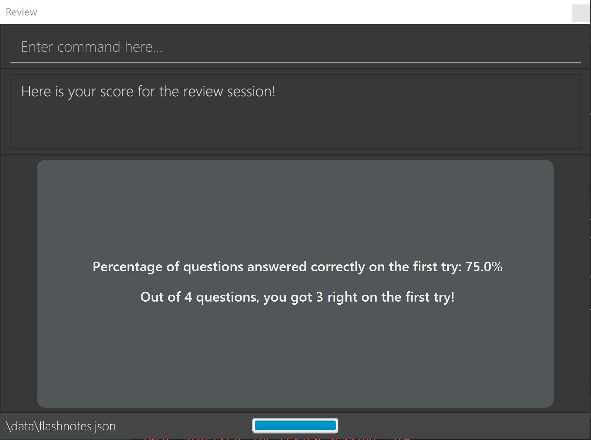

1. Review Window closes, and you are returned to the *Card Mode* you started the review session from.  
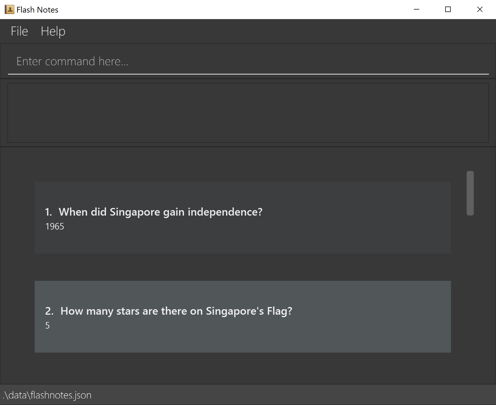

:warning: Things to note:

* `endReview` can only be activated from the Review Window to return to the *Card* Mode you started the review session from.
* No additional inputs should be added behind the `endReview` command.

### About Review Statistics

At the end of a review session, FlashNotes will calculate your score for the session and display in a format similar to the image shown below.  

As shown in the above image, the Review Window will display the following information:
 * The **total number of questions** you undertook in the review session.
 * The **number of questions marked as correct during your first attempt** at the question.
 * The calculated **percentage of questions answered correctly on your first attempt**, a numeric value between 0 and 100, rounded to 1 decimal place.

Of the three types of information, only the calculated percentage will be saved by FlashNotes. This is so that you can track your revision progress for any deck that you conduct a review session in.

To view the statistics of your last review session for any deck, simply navigate back to the **Main Mode** and look under the Deck's name as indicated in the image below.

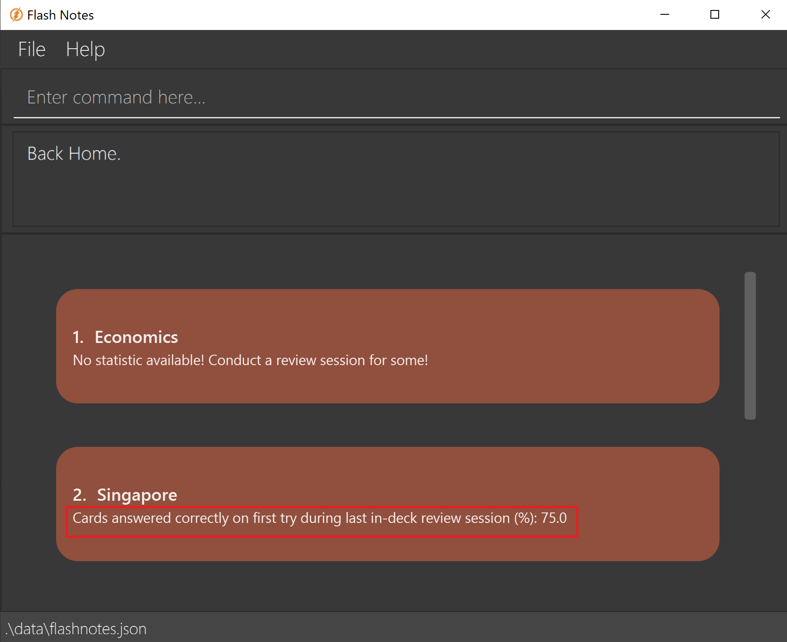

:warning: Things to note:

* FlashNotes will calculate and save your review statistics only if you have marked all the questions in the review session as correct. Exiting or ending the review session early will not generate or save the result statistics of the incomplete review session.
* Regarding the review statistics of any review session started after the usage of the `listAll` command in **Main Mode** (or in other words: any review sessions started with all the cards in FlashNotes), the review statistics for such review sessions will still be generated and displayed, but it will not be saved by FlashNotes.

--------------------------------------------------------------------------------------------------------------------

## FAQ

How do I transfer my data to another Computer?
 
Install the app in the other computer and overwrite the data file with the file that contains the 
data of your previous FlashNotes home folder.
  
 

What should I do if I have problems launching the application?
 
Ensure that Java 11 has been installed on your computer, and that you have the most recent version of the application.
  
 

When I exit the program, will all my new flashcards and updates be saved?
 
Yes! Whatever changes that have been made while the application was running will be saved in the data folder. To 
ensure none of your data is lost, do not delete the data folder.
  
 

Is it possible to restore a deck that I just deleted?
 
Sorry but no. There is no such functionality at this point in time.
  
 

What should I do when I get a 'Java Quit unexpectedly' error. (For Mac Users)
 
Open System Preferences in you computer,  click on ‘Security & Privacy’ and then proceed to click on Privacy Tab and 
the ‘Input Monitoring’ section. Enable java to monitor input from your keyboard even while using other apps.
  

--------------------------------------------------------------------------------------------------------------------

## Command summary

### Main Mode

Action | Format, Examples
--------|------------------
**Add Deck** | `Format: addDeck n/DECKNAME`  e.g., `addDeck n/Default`
**Open Deck** | `Format: enterDeck DECKNAME`   e.g., `enterDeck Default`
**Delete Deck** | `Format: deleteDeck INDEX`  e.g., `deleteDeck 1`
**Edit Deck Name** | `Format: editDeckName INDEX n/NEWDECKNAME`  e.g., `editDeckName 1 n/History`
**List All** | `listAll`
**Help** | `help`
**Clear** | `clear`
**Set Review Limit** | `setReviewLimit LIMIT`   e.g., `setReviewLimit 30`, `setReviewLimit all`
**Check Review Limit** | `checkReviewLimit`
**Exit** | `exit`

### Card Mode

Action | Format, Examples
--------|------------------
**Add Card** | `Format: addCard q/QUESTION a/ANSWER `
**Delete Card** | `deleteCard INDEX`  e.g., `deleteCard 3`
**Edit Card** | `editCard INDEX [q/QUESTION] [a/ANSWER] [t/TAG]`  e.g.,`editCard 2 q/What is the real question? a/This is a real question.`
**Find** | `find KEYWORD [MORE_KEYWORDS]`  e.g., `find President`
**List** | `list`
**Help** | `help`
**Home** | `home`
**Start Review** | `review`
**Set Review Limit** | `setReviewLimit LIMIT`   e.g., `setReviewLimit 30`, `setReviewLimit all`
**Check Review Limit** | `checkReviewLimit`
**Exit** | `exit`

### Review Mode

Action | Format
--------|------------------
**Flip** | `f`
**Correct** | `c`
**Wrong** | `w`
**End Review** | `endReview`
**Help** | `help`
