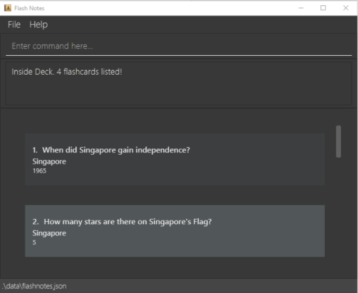
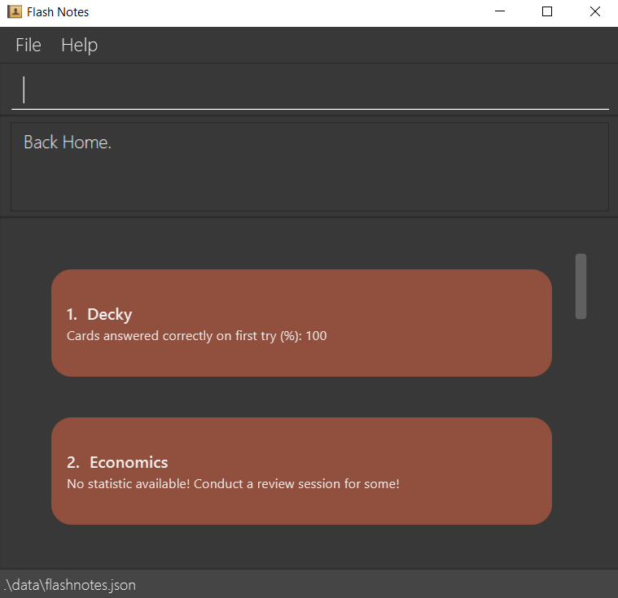
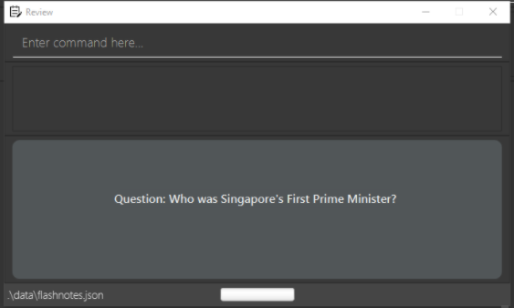

FlashNotes is a **desktop app for flashcards**, optimized for use via a Command Line Interface (CLI) while still having the benefits of a Graphical User Interface (GUI). If you can type fast, Flashnotes can help you create word-based flashcards faster than traditional GUI apps.

Flashcards are one of the oldest forms of studying methods, but it is also remarkably difficult to keep track of the vast amount of content to study for.

This User Guide will help you find out how FlashNotes is able to help you study more efficiently using flashcards and how to use it. Let's get started.

--------------------------------------------------------------------------------------------------------------------

- Table of Contents
{:toc}

--------------------------------------------------------------------------------------------------------------------
## Overview

When studying for any topics, you typically organize your notes by topics or the subjects.

You also want to be able to pull up information regarding those topics closer to examination date and review those topics.

If necessary, you may need to review it multiple times in order to track your progress and understanding. However, you don't want to have to manually update a spreadsheet everytime you review your content.

Is studying with flashcards starting to seem like a massive chore already? Fret not, FlashNotes is here to help you!

### Understanding the 3 different modes:

Available Modes | Functionality involved | Real Life Representation
--------|------------------ | ------
**Main Mode** | Holds the list of currently stored decks, which contains the list of cards internally. | Topics or Subjects of interest.
**Card Mode** | Holds the list of cards from the selected deck, or the list of all cards currently available. | Sub-questions and content knowledge.
**Review Mode** | Reads all cards from the card mode. It allows cards to be flipped and enables you to mark them correct or wrong. | Revision session.

This is a basic overview of what FlashNotes can do for you, but there are more features such as editing decks and cards.

Ready to dominate exams season? Let's get down to work.

--------------------------------------------------------------------------------------------------------------------

## Quick start

1. Ensure you have Java `11` or above installed in your Computer.

1. Download the latest version of `flashnotes.jar` from [here](https://github.com/AY2021S1-T15-2/tp/releases).

1. Copy the file to the folder you want to use as the _home folder_ for your FlashNotes.

1. Double-click the file to start the app. A GUI similar to the one below should appear in a few seconds. 
    
   _Figure 2A: Initial View of FlashNotes with GUI component labels._
   
   * **Command Box**: Where you input commands for FlashNotes.
   
   * **Result Box**: Where FlashNotes displays the resulting message to your last input in the Command Box.
   
   * **List of Decks**: Displayed list of decks currently in FlashNotes.
   
   

   
   **:information_source: About the sample data:** 
   
   Initial launch of FlashNotes will result in the application loading in with our provided sample data. This is to accommodate first-time users wishing to familiarize themselves with FlashNotes before using it in-depth.
    
   Our provided sample data is not accurate nor necessary to the application. As such, you can easily delete the sample data in the following way:
   
   * Usage of the `clear` command. 
     Clears all flashcard and deck data currently in FlashNotes. Refer under [Main Mode Features](#Main Mode Features) for further details about the command.
     
   

1. Type a command in the **Command Box** and press Enter to execute it. Some example commands you can try are:

   * **`addDeck`**`n/Languages `: Creates a new (empty) Deck named 'Languages'.

   * **`list`** : Lists all available flashcards in FlashNotes.

   * **`clear`** : Deletes all cards.

   * **`help`** : Opens the Help window.

   * **`enterDeck`**`Singapore `: Lists all cards inside the deck 'Singapore'.

   * **`exit`** : Exits the app.

1. After executing each command, a success or failure message will be displayed in the **Result Box**. This will let you know if you have successfully executed the relevant commands or not. Given that you have provided the correct command prefixes, it can even provide additional information on why your command has failed.   

1. Refer to the [Features](#Main Mode Features) below for the details of each command.

--------------------------------------------------------------------------------------------------------------------

## Explanation of Command Formats used in features

**:information_source: Notes about the command format:** 

* Words in `UPPER_CASE` are the parameters to be supplied by you. 
  e.g. in `addCard q/QUESTION`, `QUESTION` is a parameter which can be used as `add q/What is the question?`.

* Parameters can be in any order. 
  e.g. if the command specifies `q/QUESTION a/ANSWER`, `a/ANSWER q/QUESTION` is also acceptable.

--------------------------------------------------------------------------------------------------------------------

## Main Mode Features

**:information_source: Quick Summary of Main Mode:** 

* Main Mode primarily allows management of flashcard decks.
* In order to manage flashcards directly, you will need to enter card mode using the `enterDeck` Command.

### Find all flashcards within the deck : `enterDeck`

Lists flashcards within your chosen deck.

Format: `enterDeck [DECKNAME]`

* The search is case-sensitive. e.g. `GET1025` will not match `get1025`
* **only full words will** be matched e.g. `GE` will not match `GET1025`
* Flashcards matching at least one tag keyword will be returned (e.g. `GET1025 philosophy` will return cards with tags`([GET1025], [scifi]`) and (`[phylosophy], [plato]`))

Examples:
* `enterDeck Singapore` return cards with Tags `Singapore`

Outcome expected:

### Create a new Deck : `addDeck`

Lists flashcards within your chosen deck.

Format: `addDeck n/DECKNAME`

* The deck name is case-sensitive. e.g. `GET1025` will not match `get1025`
* if there is a deck that has the same existing case-sensitive name, the deck will not be created because it would be considered a duplicate deck by the system.

Examples:
* `addDeck Singapore` creates an empty deck called `Singapore`.

Outcome Expected:
- Success message displayed is: `New Deck added: Singapore`

### Rename a new Deck : `editDeck`

Edit a deck name and the tags of all corresponding cards in the deck.

Format: `editDeck INDEX n/NEWDECKNAME`

* Edits the deck name of the deck at the specified `INDEX`
* The index refers to the index number shown in the currently displayed list of flashcards
* The index **must be a positive integer** 1, 2, 3, …​
* The `NEWDECKNAME` is case-sensitive

Examples:
* `editDeck 1 History` will change the name of the deck at index `1` to `History`.

Outcome Expected:
- `to be added`

### Delete a new Deck : `deleteDeck`

Deletes the deck and all the associated cards in your specified deck.

Format: `deleteDeck DECKNAME`

* Deletes the deck with the specified `DECKNAME`
* Deletes all cards in the deck

Example:
* `deleteDeck Singapore` will delete the deck and all its corresponding cards.

Outcome Expected:
- Success message displayed is: `Deleted deck: Singapore`

### List all flashcards : `list`

Shows a list of all flashcards.

Format: `list`

Outcome Expected:
- Success message displayed is: `Inside Deck. 9 flashcards listed! Listed all flashcards`

* Any cards added while in the list mode will be added to the `Default` deck.

### Clear all entries : `clear`

Clears all decks and flashcards from the program.

Format: `clear`

Outcome Expected:
- Success message displayed is: `Flash Notes has been cleared!`

--------------------------------------------------------------------------------------------------------------------

## Card Mode Features

**:information_source: Quick Summary of Card Mode:** 

* Card Mode primarily allows management of flashcards.
* In order to manage decks directly, need to return to main mode via home command.

### Viewing help : `help`

Shows a message explaining how to access the help page.

Format: `help`

Outcome Expected:
- Success message displayed is: `Opened help window.`
- Help Window pop up with the link to user guide.

### Adding a flashcard : `addCard`

Adds a card to the currently stored notes.

Format: `addCard n/QUESTION a/ANSWER`

Examples:
* `addCard q/When did Singapore gain independence? a/9th August 1965`

Outcome Expected:
- Success message displayed is: `New flashcard added: Question: When did Singapore gain independence? Answer: 9th August 1965 Tag: Singapore.`

### Editing a flashcard : `editCard`

Edits an existing flashcard in the flashcard deck.

Format: `editCard INDEX [q/QUESTION] [a/ANSWER]`

* Edits the flashcard at the specified `INDEX`. The index refers to the index number shown in the displayed desk list. The index **must be a positive integer** 1, 2, 3, …​
* At least one of the optional fields must be provided.
* Existing values will be updated to the input values.

Examples:
*  `editCard 2 a/Lee Kuan Yew` Edits the answer of the 2nd flashcard to be `Lee Kuan Yew`

Outcome Expected:
- Success message displayed is: `Edited flashcard: Question: When did Singapore gain independence? Answer: LKY Tag: Singapore.`

### Finding flashcards : `find`

Finds flashcards which contain any of the given keywords.

Format: `find KEYWORD [MORE_KEYWORDS]`

* The search is case-insensitive. e.g `test` will match `Test`
* **Only full words will** be matched e.g. `Art` will not match `Artifact`
* Flashcards matching at least one keyword will be returned. (e.g. `Conflict Resolution` will return `Handling Conflict`, `Resolution`)

Examples:
* `find history` returns `History of WWII` and `History of Cuban war of Independence`
* `find Business` returns `Business Management`
* `find conflict resolution` returns `Handling Conflict` and `Resolution`

Outcome Expected:
- Success message displayed is: `3 flashcards found`

### Deleting a flashcard : `deleteCard`

Deletes the specified flashcard from the flashcard deck.

Format: `deleteCard INDEX`

* Deletes the flashcard at the specified `INDEX`.
* The index refers to the index number shown in the currently displayed list of flashcards
* The index **must be a positive integer** 1, 2, 3, …​

Examples:
* `list` followed by `deleteCard 2` deletes the 2nd flashcard from the flashcard deck.
* `find English` followed by `deleteCard 1` deletes the 1st flashcard shown in the results of the `find` command.

Outcome Expected:
- Success message displayed is: `Deleted Flashcard: Question: When did Singapore gain independence? Answer: 9th August 1965 Tag: Singapore.`

### Set card limit for review session : `setReviewLimit`

Sets the maximum number of cards that can be reviewed in a single review session.

Format: `setReviewLimit REVIEW_LIMIT`

* `REVIEW_LIMIT` can be an integer greater than 0
* `REVIEW_LIMIT` can be the string `all`. (case sensitive)
* This review card limit applies to all decks once it is set. 
* This review card limit is remembered by the program. (You do not have to set the card limit 
again after he/she closes and reopens the application)

Examples:
* `setReviewLimit 20` sets a limit of 20 cards per review session.
* `setReviewLimitall` removes the card limit and lets you review all cards in the deck.

Outcome Expected:
- Success message displayed is: `Review card limit successfully updated!`

### Return to Main Mode : `home`

Return to Main mode with list of decks.

Format: `home`

Outcome Expected:

### Exiting the program : `exit`

Exits the program.

Format: `exit`

Outcome Expected:
- Program closes down and saves all current data.

### Saving the data

FlashNotes saves data to the hard disk automatically after any command that changes the data. There is no need to save manually.

### Opens the review mode: `review`

Opens the review mode to display cards one by one so that you can review them.

Format: `review`

Outcome Expected:

* This command is only valid in the card mode.

--------------------------------------------------------------------------------------------------------------------

## Review Mode Features

**:information_source: Quick Summary of Review Mode:** 

* Review Mode primarily allows active flashcards to be used for revision.
* It also provides relevant statistics upon completion of review session.
* Enter Review mode by calling `review` command in card mode.

### Flip a flashcard: `flip`

Flips the flashcard which is being reviewed so that you can view the answer to the question.

Format: `flip`

* Flips the flashcard that is being reviewed to reveal the answer.

Examples:
* `flip` returns `The sea is blue because water absorbs colors in the red part of the light spectrum` 
 which is the answer to the question `Why is the sea blue?`.

Outcome Expected:
- Success message displayed is: `Flipping Flashcard as requested ...`

### Mark a flashcard as correct: `c`

Marks the flashcard that is being reviewed as correct and proceeds to show the next flashcard.

Format: `c`

* Marks flashcard as correct before moving on to show the question of the next flashcard.

Examples:
* `c` returns next card in deck if any.

Outcome Expected:
- Success message displayed is: `Marking Flashcard as correct as requested ...`

### Mark a flashcard as wrong: `w`

Marks the flashcard that is being reviewed as wrong and proceeds to show the next flashcard.

Format: `w`

* Marks flashcard as wrong before moving on to show the question of the next flashcard.

Examples:
* `w` returns next card in deck if any.

Outcome Expected:
- Success message displayed is: `Marking Flashcard as wrong as requested ...`

### End current review session: `endReview`

Ends the current review session and shows review statistics.

Format: `endReview`

Outcome Expected:
- Review Window is closed.

--------------------------------------------------------------------------------------------------------------------

## FAQ

**Q**: How do I transfer my data to another Computer? 
**A**: Install the app in the other computer and overwrite the empty data file it creates with the file that contains the data of your previous FlashNotes home folder. 
**Q**: What should I do if I have problems launching the application?  
**A**: Ensure that Java 11 has been installed on your computer, and that you have the most recent version of the application.  
**Q**: When I exit the program, will all my new flashcards and updates be saved?  
**A**: Yes! Whatever changes that have been made while the application was running will be saved in the data folder. To ensure none of your data is lost, do not delete the data folder.  
**Q**: Is it possible to restore a deck that I just deleted?  
**A**: Sorry but no. There is no such functionality at this point in time. 

--------------------------------------------------------------------------------------------------------------------

## Command summary

### Main Mode

Action | Format, Examples
--------|------------------
**Add Deck** | `Format: addDeck n/[DECKNAME]`  e.g., `addDeck Default`
**Read Deck** | `Format: enterDeck [DECKNAME]`   e.g., `enterDeck Default`
**Delete Deck** | `Format: delete [DECKNAME]`  e.g., `delete Default`
**Edit Deck name** | `edit [n/NEWDECKNAME] [t/TARGETDECKNAME]`  e.g., `edit n/Default Deck t/Default`
**List** | `list`
**Help** | `help`
**Clear** | `clear`

### Card Mode

Action | Format, Examples
--------|------------------
**Add Card** | `Format: addCard q/QUESTION a/ANSWER `
**Delete Card** | `deleteCard INDEX`  e.g., `deleteCard 3`
**Edit Card** | `editCard INDEX [q/QUESTION] [a/ANSWER]`  e.g.,`editCard 2 q/What is the real question? a/This is a real question.`
**Find** | `find KEYWORD [MORE_KEYWORDS]`  e.g., `find James Jake`
**Help** | `help`
**Home** | `home`
**Start Review** | `review`
**Set Review Limit** | `setReviewLimit LIMIT`   e.g., `setReviewLimit 30`

### Review Mode

Action | Format
--------|------------------
**Flip** | `flip`
**Correct** | `c`
**Wrong** | `w`
**End Review** | `endReview`
