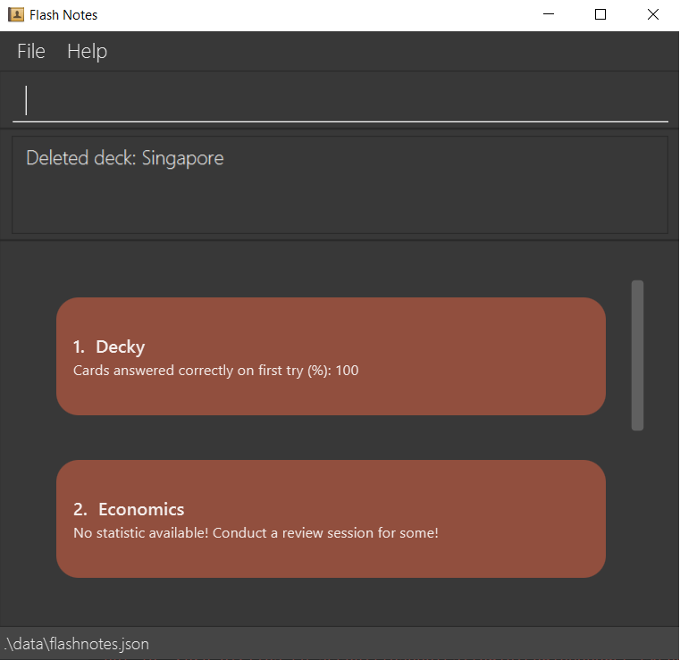

FlashNotes is a **desktop app for flashcards**, optimized for use via a Command Line Interface (CLI) while still having the benefits of a Graphical User Interface (GUI). If you can type fast, Flashnotes can help you create word-based flashcards faster than traditional GUI apps.

* Table of Contents
{:toc}

--------------------------------------------------------------------------------------------------------------------

## Quick start

1. Ensure you have Java `11` or above installed in your Computer.

1. Download the latest `flashnotes.jar` from [here](https://github.com/AY2021S1-T15-2/tp/releases).

1. Copy the file to the folder you want to use as the _home folder_ for your FlashNotes.

1. Double-click the file to start the app. The GUI similar to the below should appear in a few seconds. Note how the app contains some sample data. 
   

1. Type the command in the command box and press Enter to execute it. e.g. typing help and pressing Enter will open the help window. Some example commands you can try:
   * **`list`** : list all card

   * **`addDeck`**`n/Economics `: create new empty Deck named Economics

   * **`deleteDeck`**`Singapore` : Deletes the existing Deck named Singapore and all cards inside it.

   * **`clear`** : Deletes all cards.

   * **`find`**`question`: Returns all cards with description matching question.

   * **`enterDeck`**`Singapore`: Returns all cards inside the deck 'Singapore'.

   * **`exit`** : Exits the app.

1. Refer to the [Features](#features) below for details of each command.

--------------------------------------------------------------------------------------------------------------------

## Features

**:information_source: Notes about the command format:** 

* Words in `UPPER_CASE` are the parameters to be supplied by the user. 
  e.g. in `addCard q/QUESTION`, `QUESTION` is a parameter which can be used as `add q/What is the question?`.

* Parameters can be in any order. 
  e.g. if the command specifies `q/QUESTION a/ANSWER`, `a/ANSWER q/QUESTION` is also acceptable.

--------------------------------------------------------------------------------------------------------------------

## Main Mode (Home Screen)

**:information_source: Quick Summary of Main Mode:** 

* Main Mode primarily allows management of flashcard decks.
* In order to manage flashcards directly, need to enter deck mode.

### Find all flashcards within the deck : `enterDeck`

Lists flashcards within the given deck.

Format: `enterDeck [DECKNAME]`

* The search is case-sensitive. e.g. `GET1025` will not match `get1025`
* only full words will be matched e.g. `GE` will not match `GET1025`
* Flashcards matching at least one tag keyword will be returned (e.g. `GET1025 philosophy` will return cards with tags`([GET1025], [scifi]`) and (`[phylosophy], [plato]`))

Examples:
* `enterDeck Singapore` return cards with Tags `Singapore`

### Create a new Deck : `addDeck`

Lists flashcards within the given deck.

Format: `addDeck n/DECKNAME`

* The deck name is case-sensitive. e.g. `GET1025` will not match `get1025`
* if there is a deck that has the same existing case-sensitive name, the deck will not be created because it would be considered a duplicate deck by the system.

Examples:
* `addDeck Singapore` creates an empty deck called `Singapore`.

### Rename a new Deck : `editDeck`

Edit a deck name and the tags of all corresponding cards in the deck.

Format: `editDeck INDEX n/NEWDECKNAME`

* Edits the deck name of the deck at the specified `INDEX`
* The index refers to the index number shown in the currently displayed list of flashcards
* The index **must be a positive integer** 1, 2, 3, …​
* The `NEWDECKNAME` is case-sensitive

Examples:
* `editDeck 1 History` will change the name of the deck at index `1` to `History`.

### Delete a new Deck : `deleteDeck`

Deletes the deck and all the cards in the deck.

Format: `deleteDeck DECKNAME`

* Deletes the deck with the specified `DECKNAME`
* Deletes all cards in the deck

Example:
* `deleteDeck Singapore` will delete the deck and all its corresponding cards.

### Listing all flashcards : `list`

Shows a list of all flashcards.

Format: `list`

* Any cards added while in the list mode will be added to the `Default` deck.

### Clearing all entries : `clear`

Clears all decks and flashcards from the program.

Format: `clear`

--------------------------------------------------------------------------------------------------------------------

# Card Mode (List of Cards)

**:information_source: Quick Summary of Deck Mode:** 

* Deck Mode primarily allows management of flashcards.
* In order to manage decks directly, need to return to deck mode via home command.

### Viewing help : `help`

Shows a message explaining how to access the help page.

Format: `help`

### Adding a flashcard : `addCard`

Adds a card to the currently stored notes.

Format: `addCard n/QUESTION a/ANSWER`

Examples:
* `addCard q/When did Singapore gain independence? a/9th August 1965`

### Editing a flashcard : `editCard`

Edits an existing flashcard in the flashcard deck.

Format: `editCard INDEX [q/QUESTION] [a/ANSWER]`

* Edits the flashcard at the specified `INDEX`. The index refers to the index number shown in the displayed desk list. The index **must be a positive integer** 1, 2, 3, …​
* At least one of the optional fields must be provided.
* Existing values will be updated to the input values.

Examples:
*  `editCard 2 a/Lee Kuan Yew` Edits the answer of the 2nd flashcard to be `Lee Kuan Yew`

### Finding flashcards : `find`

Finds flashcards which contain any of the given keywords.

Format: `find KEYWORD [MORE_KEYWORDS]`

* The search is case-insensitive. e.g `test` will match `Test`
* Only full words will be matched e.g. `Art` will not match `Artifact`
* Flashcards matching at least one keyword will be returned. (e.g. `Conflict Resolution` will return `Handling Conflict`, `Resolution`)

Examples:
* `find history` returns `History of WWII` and `History of Cuban war of Independence`
* `find Business` returns `Business Management`
* `find conflict resolution` returns `Handling Conflict` and `Resolution`

### Deleting a flashcard : `deleteCard`

Deletes the specified flashcard from the flashcard deck.

Format: `deleteCard INDEX`

* Deletes the flashcard at the specified `INDEX`.
* The index refers to the index number shown in the currently displayed list of flashcards
* The index **must be a positive integer** 1, 2, 3, …​

Examples:
* `list` followed by `deleteCard 2` deletes the 2nd flashcard from the flashcard deck.
* `find English` followed by `deleteCard 1` deletes the 1st flashcard shown in the results of the `find` command.

### Setting card limit for review session : `setReviewLimit`

Sets the maximum number of cards that can be reviewed in a single review session.

Format: `setReviewLimit REVIEW_LIMIT`

* `REVIEW_LIMIT` can be an integer greater than 0
* `REVIEW_LIMIT` can be the string `all`. (case sensitive)
* This review card limit applies to all decks once it is set. 
* This review card limit is remembered by the program. (User does not have to set the card limit 
again after he/she closes and reopens the application)

Examples:
* `setReviewLimit 20` sets a limit of 20 cards per review session.
* `setReviewLimitall` removes the card limit and lets user review all cards in the deck.

### Return to Main Mode : `home`

Return to Main mode with list of decks.

Format: `home`

### Exiting the program : `exit`

Exits the program.

Format: `exit`

### Saving the data

FlashNotes saves data to the hard disk automatically after any command that changes the data. There is no need to save manually.

### Opens the review mode: `review`

Opens the review mode to display cards one by one so that users can review them.

Format: `review`

* This command is only valid in the card mode.

--------------------------------------------------------------------------------------------------------------------

## Review Mode

**:information_source: Quick Summary of Review Mode:** 

* Review Mode primarily allows active flashcards to be used for revision.
* It also provides relevant statistics if the review session was fully completed.

### Flip a flashcard: `flip`

Flips the flashcard which is being reviewed so that the user can view the answer to the question.

Format: `flip`

* Flips the flashcard that is being reviewed to reveal the answer.

Examples:
* `flip` returns `The sea is blue because water absorbs colors in the red part of the light spectrum` 
 which is the answer to the question `Why is the sea blue?`.

### Mark a flashcard as correct: `c`

Marks the flashcard that is being reviewed as correct and proceeds to show the next flashcard.

Format: `c`

* Marks flashcard as correct before moving on to show the question of the next flashcard.

Examples:
* `c` returns next card in deck if any.

### Mark a flashcard as wrong: `w`

Marks the flashcard that is being reviewed as wrong and proceeds to show the next flashcard.

Format: `w`

* Marks flashcard as wrong before moving on to show the question of the next flashcard.

Examples:
* `w` returns next card in deck if any.

### End current review session: `endReview`

Ends the current review session and shows review statistics.

Format: `endReview`

--------------------------------------------------------------------------------------------------------------------

## FAQ

**Q**: How do I transfer my data to another Computer? 
**A**: Install the app in the other computer and overwrite the empty data file it creates with the file that contains the data of your previous FlashNotes home folder. 
**Q**: What should I do if I have problems launching the application?  
**A**: Ensure that Java 11 has been installed on your computer, and that you have the most recent version of the application.  
**Q**: When I exit the program, will all my new flashcards and updates be saved?  
**A**: Yes! Whatever changes that have been made while the application was running will be saved in the data folder. To ensure none of your data is lost, do not delete the data folder.  
**Q**: Is it possible to restore a deck that I just deleted?
**A**: Sorry but no. There is no such functionality at this point in time. 

--------------------------------------------------------------------------------------------------------------------

## Command summary

### Main Mode

Action | Format, Examples
--------|------------------
**Add Deck** | `Format: addDeck n/[DECKNAME]`  e.g., `addDeck Default`
**Read Deck** | `Format: enterDeck [DECKNAME]`   e.g., `enterDeck Default`
**Delete Deck** | `Format: delete [DECKNAME]`  e.g., `delete Default`
**Edit Deck name** | `edit [n/NEWDECKNAME] [t/TARGETDECKNAME]`  e.g., `edit n/Default Deck t/Default`
**List** | `list`
**Help** | `help`
**Clear** | `clear`
**List** | `list`

### Card Mode

Action | Format, Examples
--------|------------------
**Add Card** | `Format: add q/QUESTION a/ANSWER `
**Delete Card** | `delete INDEX`  e.g., `delete 3`
**Edit Card** | `edit INDEX [q/QUESTION] [a/ANSWER]`  e.g.,`edit 2 q/What is the real question? a/This is a real question.`
**Find** | `find KEYWORD [MORE_KEYWORDS]`  e.g., `find James Jake`
**Help** | `help`
**Home** | `home`

### Review Mode

Action | Format
--------|------------------
**Flip** | `flip`
**Correct** | `c`
**Wrong** | `w`
**End Review** | `endReview`
